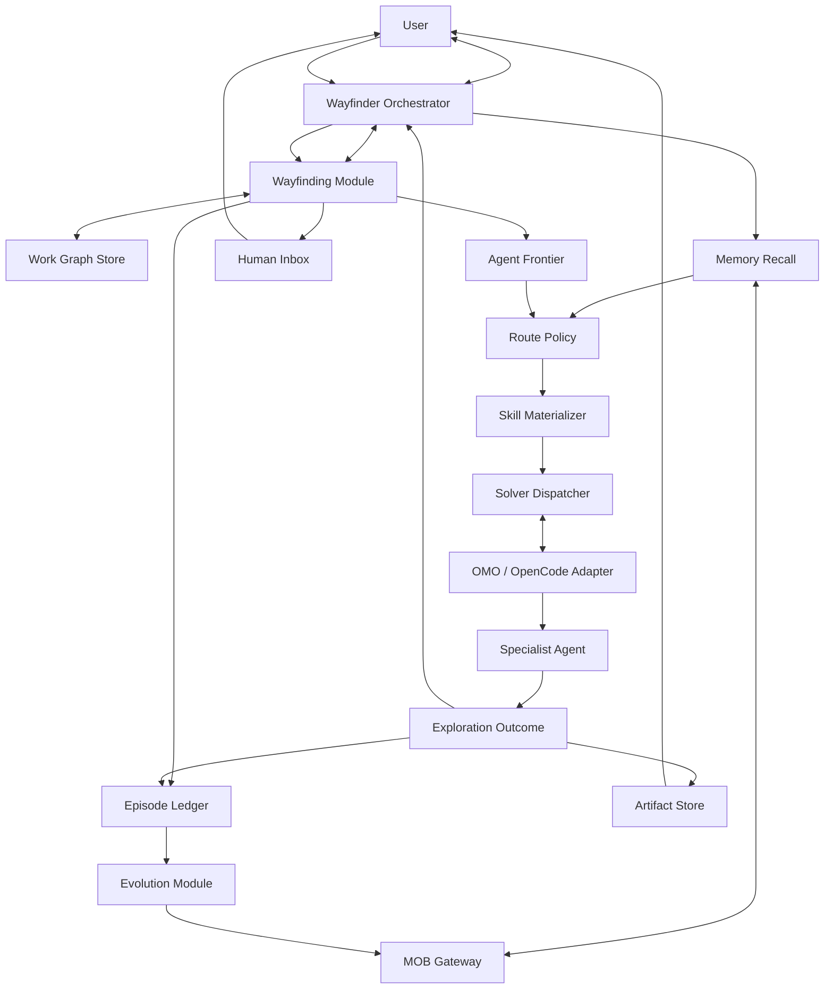

# Asterflow architecture blueprint

Status: canonical conceptual architecture. Interfaces remain provisional until
the first vertical slices validate them.

Date: 2026-07-27

## 1. Purpose

Asterflow coordinates human and machine work toward observable outcomes. It
must remain useful for a one-turn task, but scale to long-running,
multi-session work with dynamic decomposition, human decisions, recoverable
execution, reusable experience, and controlled self-improvement.

The system has two kinds of progress:

- **within one Destination**, Asterflow reveals and traverses a dynamic Work
  Graph;
- **across Destinations**, MOB accumulates reviewed Pattern Families so known
  routes do not need to be rediscovered.

The architecture deliberately separates those two loops.

## 2. Document hierarchy

| Document | Authority |
|---|---|
| [`CONTEXT.md`](../../CONTEXT.md) | Canonical domain language |
| [ADR-0001](../adr/0001-wayfinder-single-control-plane.md) | One user-facing authority and one canonical Work Graph |
| [ADR-0002](../adr/0002-separate-map-exploration-and-learning.md) | Separation of live map, Exploration, Episode, and learned routes |
| This blueprint | Current system-wide synthesis |
| [Roguelike Work Graph and evolving MOB](roguelike-work-graph-and-evolving-mob.md) | Detailed rationale for dynamic maps and adaptive routes |
| [Wayfinder control plane](wayfinder-control-plane.md) | Earlier control-plane baseline; authoritative only where this blueprint does not revise it |
| Research reports | Source evidence and rejected or superseded framings |
| Handoffs | Historical continuation state, not architecture authority |

## 3. System shape



Only the Wayfinder Orchestrator presents one continuous authority to the user.
It does not implement every behavior itself. It coordinates deep Modules
through small Interfaces and remains the only writer of the current Work
Graph.

## 4. Architectural planes

### 4.1 Human plane

The human plane presents:

- Destination clarification;
- progress and evidence;
- versioned Artifacts;
- Human Actions requiring judgment, approval, credentials, permission, or
  external action;
- MOB review proposals.

The conversation is an interface, not the coordination database. Human Inbox
is projected from the Work Graph and may be rendered in chat, a dashboard, or
another Adapter.

### 4.2 Control plane

The Wayfinder Orchestrator:

- pins the Destination and its acceptance conditions;
- asks MOB for compact, relevant recall;
- inspects the current Work Graph;
- selects the next useful Exploration;
- assigns one bounded Work Item under one Claim;
- incorporates Exploration Outcomes;
- accepts or rejects proposed Graph Deltas;
- triggers verification and parent synthesis;
- creates precise Human Actions;
- determines whether the Destination is complete.

Control authority does not recurse. The Work Graph may recurse indefinitely,
but Specialist Agents never become competing Orchestrators.

### 4.3 State plane

The state plane owns:

- the current Destination revision;
- revealed Work Items;
- parent-child and dependency edges;
- Knowledge and Fog;
- Claims and Checkpoints;
- accepted Resolutions;
- Artifact references;
- current graph revision.

Agent Frontier and Human Inbox are derived projections. Runtime sessions and
long-term MOB memories are references from this plane, not embedded copies.

### 4.4 Execution plane

The execution plane provides:

- model and Specialist Agent selection;
- tool, Skill, MCP, permission, and budget binding;
- foreground and background sessions;
- cancellation, timeout, and recovery;
- structured Exploration Outcome collection;
- optional multiplexer and visual status projection.

OMO-Slim and OpenCode are the starting implementation Adapter for this plane.
Their Background Job Board remains runtime state and must not become the Work
Graph.

### 4.5 Method plane

The method plane turns selected knowledge and project Skills into execution
guidance for one Exploration.

A Skill is not a permanent node label. It is a method that may be selected,
composed, or materialized after the Orchestrator has inspected the node,
current Fog, Hard Envelope, recalled Pattern Family, capabilities, and risk.

Matt Skills are the starting library of solving methods. Their top-level
control assumptions do not override the Wayfinder Orchestrator.

### 4.6 Learning plane

The learning plane:

- records immutable Episodes and measured outcomes;
- recalls reviewed Pattern Families;
- compares Champion and Challenger Route Variants;
- detects failures, stale routes, and capability gaps;
- creates review proposals;
- promotes, revises, retains, or retires knowledge only through MOB
  governance.

MyOutBrain is the starting implementation of reviewed recall and promotion. It
does not store the current Work Graph or authorize Asterflow actions.

## 5. Information ownership

| Fact | Owner | Explicit non-owner |
|---|---|---|
| User-visible direction | Wayfinder Orchestrator | Specialist Agent |
| Current revealed map | Work Graph Store | MOB, chat history, Job Board |
| Ready machine work | Agent Frontier projection | Separate backlog |
| Required human work | Human Inbox projection | Separate inbox database |
| Active assignment lease | Claim | OpenCode session ownership |
| Runtime job status | OMO/OpenCode Adapter | Work Item disposition |
| Exploration result | Exploration Outcome | Raw transcript |
| Current route history | Episode Ledger | Mutable Work Graph |
| Reusable reviewed route | MOB Pattern Family | Episode Ledger |
| Executable guidance | Materialized Skill | Canonical MOB storage |
| Binary and visual output | Artifact Store | Conversation text |
| Completion evidence | Resolution and verification records | Historical familiarity |

The first local prototype may store several records in one directory, but
their semantics and identities remain separate.

## 6. Core domain flow

### 6.1 Enter a Destination

1. Translate the request into an observable Destination.
2. Preserve the user's acceptance conditions as the Hard Envelope.
3. Ask MOB for a compact recall package.
4. Create or load the Work Graph.
5. Reveal only enough nodes to expose a useful Frontier.

Simple work may use an ephemeral one-node graph. The protocol remains the
same; persistence and ceremony scale with uncertainty and duration.

### 6.2 Select a route

1. Inspect the Work Item and current Fog.
2. Retrieve applicable Pattern Families.
3. Reject routes outside the Hard Envelope.
4. Choose a Champion or safe Challenger according to Route Policy.
5. Materialize only the guidance required for this Exploration.
6. Bind a capable Specialist Agent, tools, permissions, and cost budget.

The selected method is recorded in the Episode for audit, not persisted as the
Work Item's nature.

### 6.3 Explore a Work Item

1. Acquire a revision-bound Claim.
2. Start or resume a runtime session.
3. Provide the Work Item, relevant ancestor invariants, selected evidence,
   Checkpoint, and required outcome contract.
4. Receive a composable Exploration Outcome.
5. Release or expire the Claim.
6. Let the Orchestrator validate and apply an accepted Graph Delta.
7. Recompute Agent Frontier and Human Inbox.

An Exploration can learn facts, clear or discover Fog, reveal children,
propose dependencies, create Artifacts, request human input, and propose a
Resolution in one result.

### 6.4 Resolve human barriers

An irreducibly human need becomes an addressable Human Action with:

- the exact request;
- why a human is required;
- what it blocks;
- options and trade-offs;
- a recommendation;
- an exact Artifact version where relevant;
- accepted response forms.

The affected branch waits; independent Frontier work continues. A user
response becomes evidence and may invalidate descendants before the graph is
recomputed.

### 6.5 Verify and synthesize

A candidate Resolution does not resolve a Work Item by itself. The
Orchestrator checks:

- acceptance coverage;
- evidence sufficiency;
- Artifact integration;
- conflicts between child assumptions;
- remaining actionable Fog;
- real-entry-point behavior where applicable.

Verification may be assigned as another Exploration. Resolved children do not
automatically resolve their parent.

### 6.6 Learn across Destinations

1. Close the Episode with its terminal outcome and measured costs.
2. Compare it with relevant historical Episodes.
3. Identify reusable steps, route variants, failures, counterevidence, and
   capability gaps.
4. Generate bounded MOB learning signals and review proposals.
5. Let the user approve, revise, reject, or defer semantic changes.
6. Make approved Pattern Families available to later recall.

## 7. Deep Modules and Interfaces

These Interfaces describe seams, not final TypeScript or Python signatures.

### 7.1 Wayfinding Module

```ts
interface WayfindingModule {
  inspect(reference: DestinationReference): Promise<WayfindingSnapshot>;
  apply(command: WayfindingCommand): Promise<TransitionResult>;
}
```

The Module hides:

- graph validation and revisions;
- Fog and Knowledge updates;
- parent-child and dependency invariants;
- Claim acquisition, expiry, and stale-result rejection;
- Checkpoint attachment;
- Graph Delta validation;
- Resolution acceptance;
- Frontier and Human Inbox projection;
- restart recovery.

Storage is an internal seam with at least in-memory and local durable Adapters.
GitHub becomes a real Adapter only when collaborative synchronization is
required.

### 7.2 Solver Module

```text
Exploration Assignment → Exploration Outcome
```

The external Interface promises:

- one bounded Work Item;
- an explicit Hard Envelope;
- structured progress and evidence;
- resumability through a Checkpoint;
- cancellation and terminal status.

OMO/OpenCode is the first Adapter. Session IDs, panes, model names, and raw
tool output stay inside the Adapter or Episode audit data.

### 7.3 Memory Module

```ts
interface MemoryModule {
  recall(query: RecallQuery): Promise<RecallCandidates>;
  propose(input: LearningInput): Promise<ReviewProposalReference[]>;
}
```

The Module hides:

- MOB protocol negotiation;
- recall budgets and evidence expansion;
- canonical memory versions;
- proposal grouping and conflicts;
- storage, Vault, and index details;
- graceful failure.

The Wayfinder Orchestrator never receives direct database or Vault access.

### 7.4 Route Policy Module

```ts
interface RoutePolicyModule {
  select(context: RouteSelectionContext): Promise<RouteDecision>;
}
```

The Module owns:

- applicability evaluation;
- Hard Envelope filtering;
- Champion and Challenger candidate construction;
- Exploration Temperature;
- deterministic stochastic selection records;
- cooling and reheating policy;
- no-route explanations.

It does not execute a route or promote MOB memory.

### 7.5 Evolution Module

```ts
interface EvolutionModule {
  evaluate(episode: EpisodeReference): Promise<EvolutionProposal[]>;
}
```

The Module owns:

- comparable Episode selection;
- quality and cost evaluation;
- Pareto comparison;
- common-skeleton and conditional-branch proposals;
- failure and counterevidence extraction;
- capability-gap proposals.

Its output is always a proposal. MOB review owns semantic promotion.

### 7.6 Artifact Module

```ts
interface ArtifactModule {
  register(artifact: ProducedArtifact): Promise<ArtifactReference>;
  inspect(reference: ArtifactReference): Promise<ArtifactView>;
}
```

The Module guarantees immutable review references, provenance, and an
inspection path. Filesystem, Git branch, browser preview, and object-store
behavior are Adapters.

## 8. State model

### 8.1 Work Item

The Work Item persists:

- identity and graph relationships;
- objective;
- known information and Fog;
- acceptance and required evidence;
- objective requirements and constraints;
- `open | resolved | superseded` disposition.

It does not persist a mandatory solving method.

### 8.2 Derived availability

A Work Item enters Agent Frontier when:

- it is open;
- dependencies are satisfied;
- it is bounded enough for an Exploration;
- no human-only constraint currently blocks it;
- no conflicting write scope is active;
- no live Claim exists.

Human Inbox projects open Work Items requiring irreducibly human input.

### 8.3 Claim and execution

Claims are leases containing:

- Work Item and graph revision;
- Specialist/session identity;
- claim token;
- issue and expiry times;
- permitted write scope.

Runtime execution separately records `running`, `submitted`, `failed`, or
`cancelled`. A failed attempt does not make the Work Item permanently failed.

### 8.4 Graph Delta

A Graph Delta can:

- add or revise Knowledge and Fog;
- reveal Work Items;
- add or remove dependency edges;
- attach Checkpoints, Artifacts, or evidence;
- propose Human Actions;
- propose or accept a Resolution;
- supersede invalidated nodes.

Every accepted delta has an expected revision, idempotency key, actor, cause,
and result revision.

### 8.5 Episode

An Episode is append-only. It records the route through a Destination,
including selection-policy version, temperature, candidate probability,
route mutations, graph revisions, evidence, costs, failures, and terminal
outcome.

Whether one Exploration is a child Episode or an Episode event remains an
implementation question; the append-only causal requirement is fixed.

## 9. Adaptive routes

MOB recall may return:

- an exact contextual route;
- a stable skeleton with conditional Fog;
- an analogy;
- no relevant route.

A known route is a Champion, not a script. Safe mutations include skipping,
substituting, reordering, merging, branching, or early completion when current
evidence already satisfies acceptance.

Exploration Temperature rises with novelty, staleness, low confidence, low
risk, reversibility, and learning value. It falls with repeated evidence,
high risk, irreversibility, and urgent delivery. Verification failure or
environment drift may reheat a Pattern Family.

Only routes that already satisfy the Hard Envelope enter stochastic
selection. “High temperature” never grants permission.

The target is an evidenced contextual policy or Pareto set, not a universal
mathematical optimum.

## 10. Verification strategy

The primary test surface is each deep Module's external Interface.

### Wayfinding contract tests

- the same Graph Delta applied twice is idempotent;
- stale revisions never overwrite newer state;
- dependent nodes enter Frontier only when blockers resolve;
- Human Actions project without a second source of truth;
- restarting reproduces the same snapshot;
- children do not auto-resolve parents.

### Solver Adapter tests

- one assignment yields one structured outcome;
- timeout and cancellation preserve a resumable Checkpoint;
- late output from an expired Claim is rejected;
- session mechanics do not leak into Work Item state.

### Memory contract tests

- recall remains bounded and source-backed;
- MOB failure degrades without stopping execution;
- unreviewed proposals do not enter canonical recall;
- current Work Graph data is not copied into MOB.

### Evolution tests

- invalid routes are filtered before selection;
- the same seed and policy version reproduce selection;
- lower-cost invalid routes never beat valid routes;
- incomparable trade-offs remain separate variants;
- drift can lower confidence and reheat exploration.

### End-to-end vertical slice

Create a Fog-bearing Destination, recall one conditional route, claim and
explore a node, create a Human Action and Checkpoint, resume after restart,
accept a Resolution, close the Episode, and produce a MOB review proposal.

## 11. Reliability and degradation

| Failure | Required behavior |
|---|---|
| MOB unavailable | Continue without recall or learning |
| Specialist crashes | Expire Claim and resume from Checkpoint |
| Stale outcome | Reject against graph revision |
| Partial durable write | Detect and repair idempotently |
| Human unavailable | Queue Human Action and continue independent branches |
| Artifact preview unavailable | Preserve Artifact reference and offer another inspection Adapter |
| Route verification fails | Preserve failure evidence, lower confidence, and reconsider Frontier |
| Prompt cache would be invalidated | Inject volatile state only at the trailing cache-safe position |

## 12. Security and governance

- The Hard Envelope is established before route selection.
- Tool permission is enforced by the runtime, not only by prompts.
- Specialist Agents receive least-privilege tools and relevant context.
- External writes follow existing user authorization and dry-run rules.
- MOB private-instance storage stays behind the Memory Gateway.
- Canonical memory changes retain source, version, conflict, and review
  history.
- Exploration does not imply permission to install a Capability.
- Destination revision is explicit when the desired outcome changes.

## 13. Delivery roadmap

### Phase 0: architecture and baselines

- import and provenance-pin the three upstream baselines;
- establish domain language and ADRs;
- consolidate the architecture and transformation plan.

### Phase 1: Work Graph kernel

- implement in-memory Work Items, Fog, dependencies, Claims, Graph Deltas,
  projections, and restart-independent contract tests;
- keep the external Interface at `inspect` and `apply`.

### Phase 2: local durability

- add a project-local durable Adapter;
- implement revisions, idempotency, Checkpoints, and restart recovery;
- add the append-only Episode ledger.

### Phase 3: OMO/OpenCode execution

- adapt OMO session launch, tracking, cancellation, and result collection to
  the Solver Interface;
- keep the Job Board as runtime projection;
- bind structured Exploration Outcome and Claim revisions.

### Phase 4: Human and Artifact loop

- project Human Inbox;
- adapt interview/dashboard and `wait_for_user`;
- add immutable Artifact versions and inspection references.

### Phase 5: MOB recall and reviewed learning

- add bounded problem-shape recall through the existing gateway;
- submit Episode-derived existing learning signals;
- preserve unified review and graceful degradation.

### Phase 6: Pattern Families

- validate a structured Pattern Family representation;
- add applicability and comparative evidence;
- materialize selected guidance into Skills.

### Phase 7: controlled evolution

- implement Champion/Challenger Route Policy;
- run deterministic annealing experiments;
- add offline Dream proposals and capability-gap detection;
- retain human promotion until evidence supports a narrower policy.

## 14. Open decisions

1. What is the first target runtime and root package layout?
2. What minimum Work Item content makes a node explorable?
3. Is local durability Markdown, SQLite, or an event journal with Markdown
   projections?
4. What is the exact Episode hierarchy?
5. Which Graph Delta commands belong in the first vertical slice?
6. How are write-scope conflicts expressed?
7. What Pattern Family representation fits MOB without creating a competing
   knowledge type system?
8. Which evaluation metrics are universal and which belong to the
   Destination?
9. Which route mutations are safe online?
10. Which, if any, promotion effects may become automatically approved?

These questions are implementation work for the Work Graph, MOB, and
annealing prototypes. They do not reopen the two accepted ADRs.
