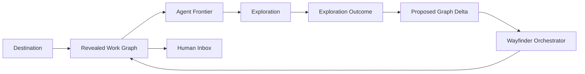
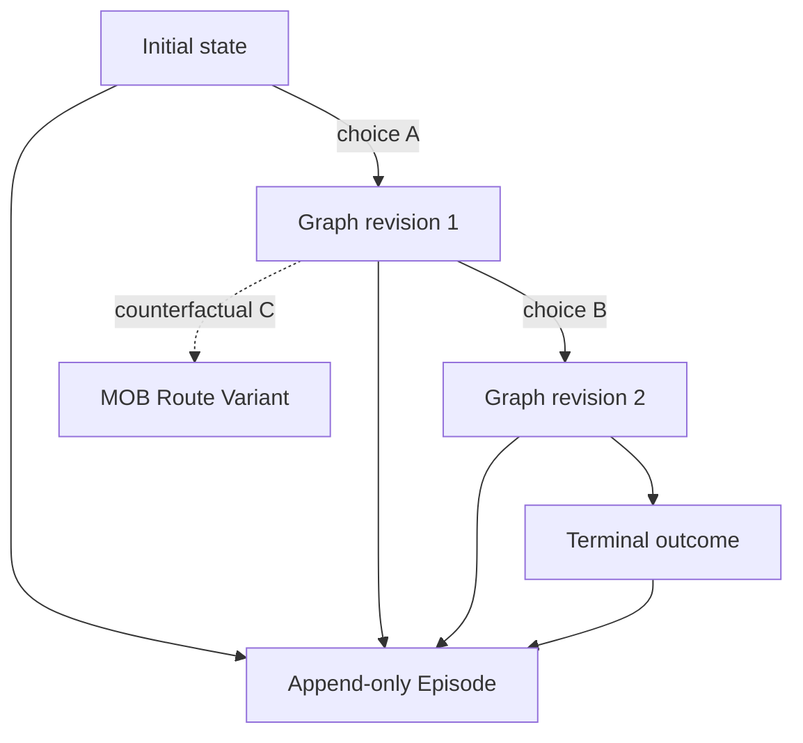
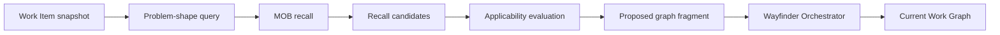

# Roguelike Work Graph and evolving MOB

Status: discussion synthesis and architecture direction. This document extends
the accepted single-Wayfinder control plane, but does not yet replace its
persisted schema or constitute an implementation specification.

Date: 2026-07-27

## 1. Context coverage and blind spots

This synthesis covers the visible design discussion on 2026-07-27 and checks
it against:

- the canonical language in [`CONTEXT.md`](../../CONTEXT.md);
- the accepted single-Wayfinder decision;
- the current Wayfinder control-plane baseline;
- the Wayfinder and fusion research reports;
- the imported OMO-Slim, Matt Skills, and MyOutBrain source baselines.

It does not claim empirical evidence for adaptive route selection. There are
not yet recorded Episodes, annealing experiments, calibrated evaluation
weights, or a decided automatic-promotion policy. A MyOutBrain private
instance was not available in this workspace, so this document is a repository
architecture artifact rather than a write to canonical MOB memory.

## 2. Decision summary

Asterflow adopts a roguelike interpretation of task execution:

1. The **Work Graph** is the revealed map for one active Destination.
2. Every **Work Item** may contain **Fog** even after the node is revealed.
3. All Work Items use the same **Exploration** cycle; the map does not label
   them with a solver method such as research, prototype, or implementation.
4. An Exploration returns a composable result that may clear Fog, discover
   Fog, reveal children, change dependencies, produce evidence, request human
   action, or propose a Resolution at the same time.
5. The Work Graph is a mutable current projection, while an **Episode** is an
   immutable record of the route actually taken.
6. MOB is cross-Destination meta-progression: it recalls reviewed **Pattern
   Families** and can propose known graph fragments instead of forcing the
   Orchestrator to rediscover every route.
7. A Pattern Family may contain several conditional **Route Variants**. There
   is no requirement to collapse them into one universally best workflow.
8. Asterflow may use an annealing-inspired policy to deviate from a proven
   route, compare the Challenger with the Champion, and improve the Pattern
   Family.
9. Annealing applies only to solution strategy. The **Hard Envelope** of
   acceptance, evidence, safety, permission, and human approval never anneals.
10. Self-evolution generates evidence-backed review proposals. It does not
    silently rewrite canonical MOB memory or weaken the Destination.

## 3. Architecture metaphor

| Roguelike concept | Asterflow concept |
|---|---|
| One run | One active Destination |
| Revealed map | Current Work Graph revision |
| Map node | Work Item |
| Hidden node contents | Fog |
| Entering a node | Exploration under a Claim |
| Newly revealed path | Accepted Graph Delta |
| Run history | Episode |
| Player experience between runs | MOB Pattern Families |
| Familiar route | Champion Route Variant |
| Experimental route | Challenger Route Variant |
| Build unlock | Reviewed Capability |
| Willingness to depart from a route | Exploration Temperature |

The metaphor is a design aid, not a user-interface commitment. Asterflow does
not need game terminology in every screen or persisted file.

## 4. The Work Graph is a revealed map

The Work Graph is not a precomputed universe of every possible action. It is
the canonical, currently revealed projection of one Destination.



Pre-generating every hypothetical branch would create false precision and
exponential graph growth. Counterfactual routes remain in MOB as Route
Variants until the current run actually reveals or selects them.

The Work Graph may retain a ruled-out or superseded branch when it is needed
to explain a decision, prevent repeated work, or preserve causality. It should
not materialize branches merely because a model can imagine them.

### 4.1 Work Item semantics

A Work Item is addressable as soon as it is revealed and bounded enough for an
Exploration. Its internal solution need not be known.

For example, `后台登录系统` can be a revealed Work Item while these remain Fog:

- which identities may log in;
- which roles exist;
- whether MFA is required;
- how sessions expire;
- which evidence demonstrates that unauthorized access is prevented.

The node does not need a persisted `kind: research` or `kind:
implementation`. Those labels describe a possible solving method, not a
stable property of the map.

Conceptually:

```ts
interface WorkItem {
  id: string;
  parentId: string | null;
  dependsOn: string[];

  objective: string;
  known: Knowledge[];
  fog: Fog[];

  acceptance: AcceptanceCondition[];
  evidenceRequired: EvidenceRequirement[];
  requirements: WorkRequirements;

  disposition: 'open' | 'resolved' | 'superseded';
}
```

This is semantic guidance, not a committed storage schema.

### 4.2 Orthogonal state

Fog, readiness, execution, and final disposition are different facts:

| Concern | Examples | Persistence rule |
|---|---|---|
| Knowledge | known facts, Fog | Persisted on the Work Item |
| Availability | agent-ready, human-ready, blocked | Derived projection |
| Claim | active, released, expired | Persisted coordination record |
| Exploration execution | running, submitted, failed, cancelled | Persisted or referenced run record |
| Disposition | open, resolved, superseded | Persisted on the Work Item |

A node may be ready for Exploration while still containing substantial Fog.
`fog → ready → claimed → running` is therefore not one valid exclusive state
machine.

## 5. Universal Exploration

Every Work Item advances through the same protocol:

```text
inspect
  → claim
  → explore
  → submit outcome
  → incorporate accepted delta
  → recompute projections
```

The Orchestrator may assign different models, tools, Skills, permissions, or
budgets, but those choices are execution policy. They do not become Work Item
taxonomy.

### 5.1 Composable outcome

An Exploration can produce several effects at once. A mutually exclusive
status union such as `submitted | needs-decomposition | blocked-by-human`
loses information and forces artificial transitions.

Conceptually:

```ts
interface ExplorationOutcome {
  basedOnRevision: string;

  learned: Knowledge[];
  clearedFog: FogReference[];
  discoveredFog: Fog[];

  proposedChildren: ProposedWorkItem[];
  proposedDependencies: ProposedDependency[];

  artifacts: ArtifactReference[];
  evidence: EvidenceReference[];

  proposedHumanActions: ProposedHumanAction[];
  resolutionCandidate?: Resolution;
  checkpoint?: Checkpoint;
  failure?: FailureRecord;
}
```

The Specialist Agent proposes this outcome. Only the Wayfinder Orchestrator
may accept it as a Graph Delta.

### 5.2 Human Action

A need for human input is not a solver method label. It is a fact that the
current Work Item cannot cross a particular constraint without a human
decision, approval, inspection, credential, or external action.

The Orchestrator can represent that fact as an addressable Work Item and
dependency:

```text
Work Item P discovers an irreducibly human decision
  → save Checkpoint
  → release P's Claim
  → reveal Human Action H
  → add dependency P depends on H
  → Human Inbox projects H
  → resolving H makes P eligible again
```

This keeps Human Inbox as a projection rather than a second task database.

## 6. Mutable map, immutable trajectory

The current Work Graph must change as choices reveal different routes. The
history of those choices must not be rewritten to match the latest map.



An Episode records:

- the initial context and Destination revision;
- each selected Work Item and Claim;
- route choices and policy reasons;
- accepted Graph Deltas;
- Artifacts and evidence;
- time, token, tool, failure, recovery, and human-attention costs;
- the terminal outcome.

The Work Graph answers “where are we now?” The Episode answers “how did we get
here?” Deleting either concept forces the other to become shallow and
overloaded.

## 7. MOB as cross-run meta-progression

MOB is not the live map. It is the reviewed memory that lets a more experienced
Asterflow recognize familiar problem shapes and avoid rediscovering known
routes.



MOB returns candidates with provenance and applicability. It never mutates the
current Work Graph.

### 7.1 Recall levels

| Recall result | Orchestrator behavior |
|---|---|
| Exact contextual match | Bind variables and propose the known graph fragment |
| Conditional match | Reuse the stable skeleton and retain differences as Fog |
| Analogical match | Use as an exploration hypothesis only |
| Miss | Explore without a recalled route |

Even an exact match cannot resolve the node by itself. The current run must
produce current evidence against the current Destination.

### 7.2 Pattern Family

A single cache value is too rigid. MOB should represent a familiar problem as
a Pattern Family:

```ts
interface PatternFamily {
  problemShape: ProblemShape;
  invariantCore: WorkflowFragment;
  variants: RouteVariant[];
  comparativeEvidence: EpisodeReference[];
  selectionPolicy: SelectionPolicy;
}
```

Each Route Variant records:

- applicability conditions;
- the reusable graph fragment or route;
- required evidence;
- adaptation points;
- known failure modes;
- supporting and counterexample Episodes;
- confidence and freshness.

The stable result of learning is often not “Variant B replaced Variant A.” It
is “use A under condition X and B under condition Y.”

## 8. MOB memories and Skills

A reviewed Pattern Family may be materialized as Skill-like execution
guidance. It need not become a literal `SKILL.md` on every update.

The distinction is:

- MOB owns reviewed knowledge, provenance, conflicts, and comparative
  evidence;
- a Skill is an executable projection of selected knowledge for one
  Exploration;
- OMO-Slim binds the selected model, tools, permissions, session, and runtime
  context.

This separation allows MOB to evolve the knowledge without turning its private
store into a live execution engine.

## 9. Annealable route execution

A proven Skill or Route Variant is a Champion, not an inflexible script.

Given a baseline route:

```text
A → B → C
```

Asterflow may explore:

```text
A → B → C
A → E → C
A → C
D → B → C
D → F
```

Possible route mutations include:

- skip a step;
- substitute a step;
- reorder reversible steps;
- merge steps;
- branch into another Pattern Family;
- terminate early when the evidence already satisfies acceptance.

### 9.1 Hard Envelope

Before mutation, every candidate route must satisfy the Hard Envelope:

- user and Destination acceptance conditions;
- required evidence;
- safety constraints;
- permission and write-scope constraints;
- mandatory human-approval gates;
- irreversible-action policy.

High temperature never authorizes a route outside this envelope.

### 9.2 Exploration Temperature

Exploration Temperature controls willingness to depart from the current
Champion:

- high novelty, stale evidence, low confidence, low risk, or high learning
  value raises temperature;
- strong evidence, repeated success, high risk, irreversibility, or urgent
  delivery lowers temperature;
- repeated failure, environment drift, or performance stagnation reheats the
  Pattern Family.

The model's token-sampling temperature is an implementation detail and must not
be confused with Exploration Temperature.

For auditability, a stochastic selection records:

- selection-policy version;
- candidate set;
- selected candidate;
- temperature;
- selection probability;
- deterministic random seed;
- expected trade-offs;
- context revision.

### 9.3 Online and offline evolution

Online evolution is limited to safe, reversible, measurable deviations during
real work.

Offline evolution allows Dream or another reviewed learning process to:

- replay Episodes;
- compare fork points;
- generate larger route mutations;
- run prototypes or sandboxes;
- extract common route skeletons;
- propose conditional variants;
- propose capability gaps.

Offline evolution creates review proposals, not canonical writes.

## 10. Evaluation and promotion

Correctness is a gate, not merely another weighted metric.

```text
Hard Envelope and acceptance pass?
  no  → failure or counterexample evidence
  yes → compare quality and cost
```

Comparable metrics include:

- acceptance coverage;
- evidence quality;
- independent verification pass rate;
- Artifact quality;
- elapsed time;
- token use;
- tool calls;
- human attention;
- failure count;
- recovery cost;
- robustness across contexts.

Subjective Artifacts may require an independent Verifier, blind pairwise
comparison, multiple reviewers, or direct user preference.

After comparison, a Challenger may:

1. replace the Champion when it repeatedly dominates;
2. be rejected but retained as failure evidence;
3. remain as a conditional Route Variant;
4. join a Pareto set when trade-offs are irreducible;
5. be merged with other variants into an invariant core plus conditional
   branches.

Real tasks are non-stationary and multi-objective. Asterflow therefore aims for
the best evidenced contextual policy or Pareto set, not a provable universal
global optimum.

## 11. Capability unlocks

Repeated Fog, repeated failure, or repeated expensive work may reveal a
missing capability:

```text
repeated evidence
  → capability candidate
  → research or implementation Work Items
  → verification
  → review
  → capability becomes available to the Solver Dispatcher
```

A Capability may be a Skill, Adapter, tool integration, verification method,
or solver profile. MOB can recognize and propose the gap, but cannot install
tools, grant permissions, or approve the capability by itself.

## 12. Information ownership

| Information | Canonical owner |
|---|---|
| Current revealed nodes and dependencies | Work Graph |
| Agent Frontier and Human Inbox | Derived projections |
| Active lease | Claim |
| Current runtime session | OMO-Slim execution machinery |
| Route history and measured outcome | Episode ledger |
| Reviewed reusable route knowledge | MOB Pattern Family |
| Executable route guidance | Materialized Skill |
| Tools, models, permissions, sessions | Solver Dispatcher and OMO-Slim |
| Acceptance of canonical memory changes | Human review |

These are separate stores or records even when the first vertical slice keeps
them in one local directory.

## 13. Architectural invariants

The evolving design preserves and extends the single-control-plane decision:

1. One Wayfinder Orchestrator is the only writer of the current Work Graph.
2. Specialist Agents propose outcomes; they do not commit Graph Deltas.
3. Fog and readiness are orthogonal.
4. The Work Graph contains no required solver-method taxonomy.
5. Frontier and Human Inbox are projections.
6. The map may change; Episode history is append-only.
7. MOB recall may propose graph fragments but cannot resolve current work.
8. A MOB failure degrades recall and learning, not execution.
9. Route mutation cannot cross the Hard Envelope.
10. Canonical MOB promotion remains reviewed.
11. A different desired outcome is a different Destination, not a convenient
    reinterpretation of the old acceptance conditions.
12. Current evidence, not historical familiarity, determines completion.

## 14. Minimum experiments

### Experiment A: universal Exploration

Start with one Fog-bearing Work Item. Submit one outcome that simultaneously:

- clears one Fog item;
- discovers another;
- reveals two children;
- proposes one Human Action;
- produces one Artifact.

Verify that one accepted Graph Delta updates the map and both projections
without a solver-method label.

### Experiment B: MOB recall

Create one reviewed Pattern Family for a familiar login-system problem. Test
exact, conditional, analogical, and miss cases. Verify that recall only
proposes graph fragments and that current evidence is still required.

### Experiment C: route mutation

Use a deterministic baseline `A → B → C` and safe mutations that skip, replace,
or reorder one step. Record temperature, seed, candidate probability, quality,
time, and token usage. Verify that invalid candidates are rejected before
sampling.

### Experiment D: contextual variants

Run two variants where one is faster and the other safer. Verify that the
system retains both with explicit applicability instead of inventing a single
winner.

### Experiment E: reheating

After repeated Champion success lowers temperature, change an external
constraint and force verification failure. Verify that confidence falls,
temperature rises, and a Challenger is considered.

## 15. Open questions

1. What minimum information makes a revealed Work Item bounded enough for an
   Exploration?
2. Is an Episode one Exploration, one complete Destination route, or a
   hierarchy containing both?
3. How are accepted Graph Deltas persisted and replayed without committing to
   full event sourcing?
4. Which evaluation metrics are globally mandatory, and which are
   Destination-specific?
5. How are comparable contexts identified without hiding meaningful
   differences?
6. Which low-risk learning proposals, if any, may be promoted without explicit
   human approval?
7. How is Exploration Temperature initialized, cooled, and reheated?
8. How does Dream generate route mutations without overfitting sparse
   Episodes?
9. When should a repeated route become a literal Skill rather than remain a
   runtime projection?
10. How are capability proposals reviewed, installed, permissioned, and
    retired?

## 16. Consequences for the existing baseline

The following parts of the current control-plane document need revision before
implementation:

- remove persisted solver-method `kind` from Work Item;
- replace the single Work Item lifecycle with orthogonal knowledge,
  availability, Claim, execution, and disposition records;
- replace mutually exclusive Solver Outcome statuses with a composable
  Exploration Outcome;
- make Graph Delta acceptance explicit;
- add the append-only Episode ledger;
- deepen the MOB section from compact recall into Pattern Families,
  comparative evidence, and reviewed evolution;
- define adaptive Skill materialization and Hard Envelope enforcement;
- retain `inspect` and `apply` as the small external Interface of the
  Wayfinding Module.

These changes refine the control plane rather than reject its central
authority, canonical graph, or projection invariants.
