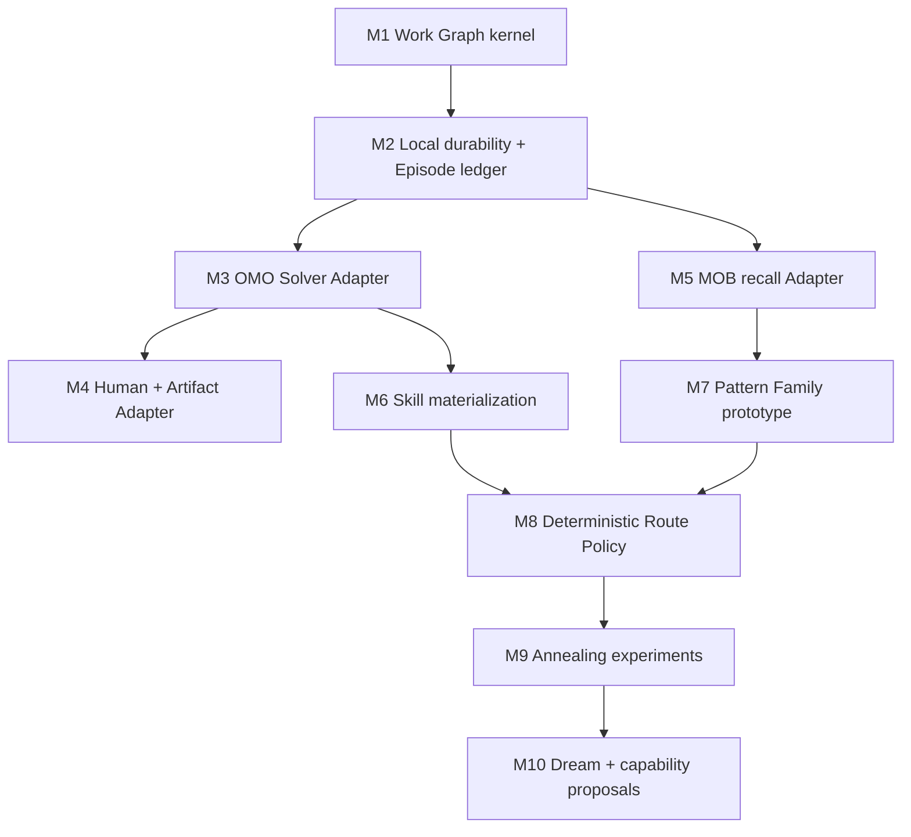

# Upstream transformation plan

Status: implementation-oriented architecture map. Paths describe imported
baselines at commit `702be02`; target Interfaces remain provisional until
their vertical slices pass.

Date: 2026-07-27

## 1. Goal

Asterflow starts from three substantial codebases, but it is not a packaging
exercise:

- OMO-Slim supplies the OpenCode runtime and multi-agent execution machinery;
- Matt Skills supplies solving methods and human collaboration workflows;
- MyOutBrain supplies governed recall, reflection, review, and long-term
  memory.

The target is one coherent product with one Wayfinder Orchestrator, one
dynamic Work Graph, one universal Exploration protocol, and a reviewed
cross-Destination learning loop.

This plan identifies what to retain, adapt, replace, or retire before editing
the imported sources broadly.

## 2. Transformation rules

### 2.1 Action vocabulary

| Action | Meaning |
|---|---|
| Retain | Behavior already fits the target; change names or wiring only when necessary |
| Adapt | Preserve the implementation leverage but change its Interface or ownership |
| Replace | Keep tests or lessons where useful, but build a different domain Module |
| Retire | Remove after all callers cross the replacement seam |
| Experiment | Modify in place only to answer a bounded design question |

### 2.2 Extraction strategy

The imported trees are evolution baselines, not read-only vendors. Early
experiments may modify them directly, but stable Asterflow domain logic should
move behind root-owned Interfaces once proven.

```text
baseline implementation
  → adapter or experiment
  → contract tests at the target seam
  → root-owned deep Module
  → migrate callers
  → retire superseded baseline path
```

Do not create a permanent fourth abstraction that merely forwards calls to an
unchanged upstream abstraction. The new Module must own real invariants and
make complexity disappear from callers.

### 2.3 Runtime recommendation

The least-destructive first implementation is:

- a TypeScript control and execution plane derived from OMO-Slim;
- a Python memory plane derived from MyOutBrain;
- a versioned local MCP/domain-protocol seam between them;
- Markdown or SQLite-backed local Work Graph storage selected by prototype.

This is a recommendation, not yet an ADR. Rewriting either runtime before its
Interface is validated would spend effort without reducing architectural
uncertainty.

## 3. Target logical Modules

| Module | Responsibility | First implementation source |
|---|---|---|
| Wayfinding Module | Work Graph, Fog, Graph Deltas, Claims, projections, Resolution invariants | New root-owned Module |
| Solver Module | One Exploration Assignment to one Exploration Outcome | OMO/OpenCode Adapter |
| Route Policy Module | Applicability, Hard Envelope, Champion/Challenger, temperature | New root-owned Module |
| Skill Materializer | Bind selected route guidance and project methods for one Exploration | Matt Skills + OMO skill registry |
| Memory Module | Bounded recall and reviewed learning proposals | MyOutBrain Gateway Adapter |
| Evolution Module | Episode comparison, Pareto analysis, route and capability proposals | New Module using MOB review |
| Artifact Module | Immutable Artifact identity and inspection | New Module with filesystem/browser Adapters |
| Human Interface Adapter | Human Inbox, questions, review, and progress | OMO interview/dashboard/chat |

## 4. OMO-Slim transformation

Baseline:
[`upstreams/oh-my-opencode-slim/`](../../upstreams/oh-my-opencode-slim/)

### 4.1 Composition and Orchestrator

| Source | Action | Required change | Validation |
|---|---|---|---|
| [`src/index.ts`](../../upstreams/oh-my-opencode-slim/src/index.ts) | Adapt | Become the OpenCode composition root for Asterflow Modules and Adapters; stop owning domain policy inline | Host smoke test loads the plugin with an injected in-memory Wayfinding Module |
| [`src/agents/orchestrator.ts`](../../upstreams/oh-my-opencode-slim/src/agents/orchestrator.ts) | Replace policy | Remove persona-based top-level routing and phase reminders as the source of truth; prompt the Orchestrator to inspect/apply the Work Graph and honor returned commands | Prompt snapshot contains stable protocol guidance but no duplicated live graph |
| [`src/agents/index.ts`](../../upstreams/oh-my-opencode-slim/src/agents/index.ts) | Adapt | Build Specialist profiles from capabilities, permissions, cost, and context limits rather than assuming a fixed task taxonomy | Dispatcher selects profiles from declared hard requirements |
| [`src/agents/*.ts`](../../upstreams/oh-my-opencode-slim/src/agents/) | Adapt/retire | Preserve useful prompts as capability profiles; retire names that only encode personality or duplicate a Skill | Each retained profile has a distinct tool/permission/capability reason |
| [`src/agents/council*.ts`](../../upstreams/oh-my-opencode-slim/src/agents/) | Experiment | Test as an independent Verifier or Challenger generator, not a second control authority | Council output is an Exploration Outcome or evaluation proposal |

Specific changes:

1. The Orchestrator system prompt should contain stable invariants and tool
   contracts only.
2. Current Destination, Frontier, Human Inbox, and selected recall are loaded
   at the trailing volatile prompt position.
3. Specialist selection takes `WorkRequirements`, Hard Envelope, risk, and
   available capabilities as input.
4. Agent display names remain presentation; graph state stores stable
   Specialist/session references.

### 4.2 Runtime jobs and Claims

| Source | Action | Required change | Validation |
|---|---|---|---|
| [`src/utils/background-job-board.ts`](../../upstreams/oh-my-opencode-slim/src/utils/background-job-board.ts) | Retain narrowly | Keep runtime jobs, aliases, reconciliation, and reuse; explicitly stop at the Solver Adapter seam | Restarting the Work Graph does not depend on the in-memory Job Board |
| [`src/utils/background-job-store.ts`](../../upstreams/oh-my-opencode-slim/src/utils/background-job-store.ts) | Adapt | Expose runtime status to the Solver Adapter, not to Work Item disposition | `failed` job can be retried while Work Item remains open |
| [`src/utils/background-job-coordinator.ts`](../../upstreams/oh-my-opencode-slim/src/utils/background-job-coordinator.ts) | Adapt | Coordinate runtime cancellation and resume against Claim tokens | Late output from an expired Claim is rejected |
| [`src/hooks/task-session-manager/`](../../upstreams/oh-my-opencode-slim/src/hooks/task-session-manager/) | Adapt | Bind launches to Exploration IDs, Claim revisions, Checkpoints, and structured outcomes | Launch, timeout, resume, completion, and cancellation contract tests |
| [`src/tools/cancel-task.ts`](../../upstreams/oh-my-opencode-slim/src/tools/cancel-task.ts) | Retain | Translate cancellation into runtime status plus a Wayfinding command where necessary | Cancellation cannot silently resolve or fail a Work Item |
| [`src/hooks/session-lifecycle.ts`](../../upstreams/oh-my-opencode-slim/src/hooks/session-lifecycle.ts) | Adapt | Emit runtime events correlated with Exploration and Episode IDs | Every terminal session is reconciled once |

The Job Board and Claim solve different problems:

- Job Board: what OpenCode sessions are running or reusable;
- Claim: which Specialist may submit a Graph Delta for which Work Item
  revision.

They may reference each other, but neither replaces the other.

### 4.3 Prompt-cache safety

| Source | Action | Required change | Validation |
|---|---|---|---|
| [`src/hooks/cache-safe-injection.ts`](../../upstreams/oh-my-opencode-slim/src/hooks/cache-safe-injection.ts) | Retain | Make it the only Adapter for volatile graph, Frontier, Human Inbox, and runtime status injection | Existing prefix-stability property tests plus Work Graph snapshots |
| [`src/hooks/cache-safety.property.test.ts`](../../upstreams/oh-my-opencode-slim/src/hooks/cache-safety.property.test.ts) | Extend | Include Memory recall and Wayfinding snapshot transforms | Earlier prompt bytes stay identical across graph revisions |
| [`src/hooks/cache-payload.snapshot.test.ts`](../../upstreams/oh-my-opencode-slim/src/hooks/cache-payload.snapshot.test.ts) | Extend | Add stable and volatile Asterflow payload surfaces | Snapshot changes are deliberate and reviewed |
| [`src/hooks/phase-reminder/`](../../upstreams/oh-my-opencode-slim/src/hooks/phase-reminder/) | Replace/retire | Replace generic phase nudges with graph-derived allowed actions | No duplicate control protocol in prompts |

### 4.4 Skills

| Source | Action | Required change | Validation |
|---|---|---|---|
| [`src/cli/custom-skills-registry.ts`](../../upstreams/oh-my-opencode-slim/src/cli/custom-skills-registry.ts) | Replace | Registry must include source, invocation policy, Hard Envelope metadata, compatibility, and provenance | Registry validation catches missing Skill assets and policy |
| [`src/cli/skills.ts`](../../upstreams/oh-my-opencode-slim/src/cli/skills.ts) | Adapt | Separate visibility, invocation, and authorization | A hidden Skill can remain explicitly invokable; a visible Skill can still be denied |
| [`src/hooks/filter-available-skills/`](../../upstreams/oh-my-opencode-slim/src/hooks/filter-available-skills/) | Adapt | Filter discovery without pretending filtering grants permission | Permission tests cover all three policies |
| [`src/skills/`](../../upstreams/oh-my-opencode-slim/src/skills/) | Merge/retire | Retain unique Asterflow operational Skills; deduplicate overlapping Matt Skills | One authoritative source per Skill meaning |
| [`src/cli/install.ts`](../../upstreams/oh-my-opencode-slim/src/cli/install.ts) | Adapt | Install selected materialized and static Skills with provenance | Clean install, upgrade, removal, and stale-skill tests |

Invocation needs three independent decisions:

1. Is the Skill visible to the model?
2. May the user invoke it explicitly?
3. Is the current Specialist authorized to execute its tools and effects?

The current filtering hook partially mixes these questions and must be split.

### 4.5 Human interface and Artifacts

| Source | Action | Required change | Validation |
|---|---|---|---|
| [`src/interview/`](../../upstreams/oh-my-opencode-slim/src/interview/) | Adapt | Render Human Inbox and exact Artifact versions; remove ownership of domain state | Rebuild UI completely from a Wayfinding snapshot |
| [`src/tools/wait-for-user.ts`](../../upstreams/oh-my-opencode-slim/src/tools/wait-for-user.ts) | Retain | Arm foreground waiting only after a Human Action exists or is proposed | Real external response releases the correct wait |
| [`src/interview/document.ts`](../../upstreams/oh-my-opencode-slim/src/interview/document.ts) | Adapt | Project Human Action records to Markdown rather than use Markdown as truth | Deleting the projection does not delete the Work Item |
| [`src/interview/dashboard.ts`](../../upstreams/oh-my-opencode-slim/src/interview/dashboard.ts) | Adapt | Become one Human Interface Adapter; use graph revisions and immutable Artifact refs | Multiple processes show the same accepted revision |
| Companion/TUI files | Adapt later | Show Destination progress, Claims, Human barriers, and verification status | UI can be disabled without affecting execution |

### 4.6 MCP, configuration, and visibility

| Source | Action | Required change | Validation |
|---|---|---|---|
| [`src/mcp/index.ts`](../../upstreams/oh-my-opencode-slim/src/mcp/index.ts) | Adapt | Register the local MOB Adapter and negotiate its capabilities | MOB absent/old/new protocol cases |
| [`src/config/schema.ts`](../../upstreams/oh-my-opencode-slim/src/config/schema.ts) | Adapt | Add Work Graph persistence, MOB, Route Policy, evaluation, and Artifact settings only after Interfaces stabilize | Generated schema and migration tests |
| [`src/multiplexer/`](../../upstreams/oh-my-opencode-slim/src/multiplexer/) | Retain | Treat panes as execution visibility Adapters | Headless behavior remains equivalent |
| TUI state | Adapt | Project from stable IDs and snapshots, not prompt parsing | Stale UI data cannot mutate domain state |

## 5. Matt Skills transformation

Baseline:
[`upstreams/matt-skills/`](../../upstreams/matt-skills/)

### 5.1 Repository-level changes

| Source | Action | Required change |
|---|---|---|
| [`skills/`](../../upstreams/matt-skills/skills/) | Adapt | Become the initial method library, not a collection of competing top-level workflows |
| [`.claude-plugin/`](../../upstreams/matt-skills/.claude-plugin/) | Retire for Asterflow runtime | Keep only if Asterflow separately publishes a Claude plugin |
| [`agents/openai.yaml`](../../upstreams/matt-skills/skills/) | Adapt | Map invocation metadata into the unified registry |
| [`README.md`](../../upstreams/matt-skills/README.md) and docs | Replace product framing | Generate Asterflow method documentation from the authoritative registry |
| [`ask-matt`](../../upstreams/matt-skills/skills/engineering/ask-matt/SKILL.md) | Retire/replace | Wayfinder Orchestrator and Route Policy replace the human-memory router |

### 5.2 Wayfinder

Source:
[`skills/engineering/wayfinder/SKILL.md`](../../upstreams/matt-skills/skills/engineering/wayfinder/SKILL.md)

Retain:

- Destination-first scope;
- Fog of war;
- lazy revelation;
- Frontier;
- claim-before-work;
- human and agent distinction;
- map-as-low-resolution index;
- one bounded context per exploration.

Replace:

- issue tracker as the mandatory canonical store;
- ticket-type labels as Work Item nature;
- `research | prototype | grilling | task` taxonomy;
- plan-only default and automatic handoff to spec;
- assignee as the complete Claim;
- mutually exclusive ticket-resolution flow;
- the Skill itself owning top-level control.

Target:

- Wayfinder semantics become Orchestrator protocol plus Wayfinding Module
  invariants;
- issue trackers become optional storage/presentation Adapters;
- every node uses universal Exploration;
- Matt Wayfinder remains source rationale and possibly a user-facing
  compatibility command.

### 5.3 Solving methods

| Skill | Target role | Required adaptation |
|---|---|---|
| [`research`](../../upstreams/matt-skills/skills/engineering/research/SKILL.md) | Evidence-gathering route fragment | Return structured evidence and Fog changes; background execution is selected by Dispatcher |
| [`prototype`](../../upstreams/matt-skills/skills/engineering/prototype/SKILL.md) | Artifact-producing route fragment | Register immutable Artifact version, question, evaluation method, and user response |
| [`grilling`](../../upstreams/matt-skills/skills/productivity/grilling/SKILL.md) | Human Action resolution method | Use Work Item context and return decision evidence; never own the map |
| `domain-modeling` | Domain-language method | Update the correct glossary and propose ADRs without taking control authority |
| [`to-spec`](../../upstreams/matt-skills/skills/engineering/to-spec/SKILL.md) | Conditional Route Variant | Produce a spec Artifact when the Destination calls for one; issue tracker is an Adapter |
| [`implement`](../../upstreams/matt-skills/skills/engineering/implement/SKILL.md) | Implementation route fragment | Remove unconditional commit behavior; respect current Claim, Hard Envelope, and accepted write scope |
| `tdd` | Verification-bearing route fragment | Preserve test-first loop as a route, not a universal Work Item label |
| `code-review` | Independent verification route | Return evidence against acceptance and standards |
| `diagnosing-bugs` | Diagnosis route fragment | Produce Fog/Knowledge deltas and candidate Resolution |
| `handoff` | Checkpoint materializer | Emit the canonical Checkpoint contract rather than free-form summary |

### 5.4 Annealable Skill format

The existing Skills optimize predictability through fixed steps. Asterflow
needs predictable Hard Envelopes with adaptable routes.

A future Skill representation should separate:

```text
Invocation and applicability
Hard Envelope
Baseline route
Adaptation points
Allowed mutation operators
Completion and evidence criteria
Evaluator
Progressively disclosed references
```

The model does not randomly ignore prose. Route Policy explicitly selects an
allowed mutation and records it in the Episode.

First mutation experiments should use copies or generated projections of
Skills. Do not mutate canonical Skill text during a live run.

## 6. MyOutBrain transformation

Baseline:
[`upstreams/myoutbrain/`](../../upstreams/myoutbrain/)

### 6.1 Keep the governance core

| Source | Action | Required change | Validation |
|---|---|---|---|
| [`mcp_server.py`](../../upstreams/myoutbrain/src/myoutbrain/mcp_server.py) | Retain | Remain the only agent-facing local tool surface | Entrances cannot access private storage directly |
| [`domain_protocol.py`](../../upstreams/myoutbrain/src/myoutbrain/domain_protocol.py) | Adapt | Negotiate Asterflow recall/evolution capabilities after the data shape stabilizes | Old clients fail closed on unknown write effects |
| [`memory_gateway.py`](../../upstreams/myoutbrain/src/myoutbrain/memory_gateway.py) | Retain behind Adapter | Do not expose its broad Interface to the Orchestrator; wrap only recall and proposal operations | Asterflow tests use an in-memory Memory Module Adapter |
| [`unified_review.py`](../../upstreams/myoutbrain/src/myoutbrain/unified_review.py) | Retain | Continue to own semantic promotion, conflicts, dependencies, and approval effects | No route enters canonical recall without its allowed review effect |
| [`v2_recall.py`](../../upstreams/myoutbrain/src/myoutbrain/v2_recall.py) | Adapt | Support problem-shape and applicability recall with bounded evidence | Exact, conditional, analogical, and miss fixtures |
| [`knowledge_views.py`](../../upstreams/myoutbrain/src/myoutbrain/knowledge_views.py) | Adapt later | Render reviewed Pattern Family views without becoming truth | Delete/rebuild view equivalence |

### 6.2 Episodes and learning signals

Do not copy the live Work Graph into MOB.

Phase 1 should:

1. keep detailed Episodes in the Asterflow Episode Ledger;
2. derive compact existing learning signals:
   `reusable-step`, `failure-and-resolution`, `confirmed-decision`,
   `user-correction`, or `research-question`;
3. reference the Episode and graph revision as provenance;
4. use the existing reflection and unified review pipeline.

Relevant sources:

- [`reflection.py`](../../upstreams/myoutbrain/src/myoutbrain/reflection.py);
- [`scheduled_reflection.py`](../../upstreams/myoutbrain/src/myoutbrain/scheduled_reflection.py);
- [`tests/test_cli_learning_reflection.py`](../../upstreams/myoutbrain/tests/test_cli_learning_reflection.py);
- [`tests/test_cli_scheduled_reflection.py`](../../upstreams/myoutbrain/tests/test_cli_scheduled_reflection.py).

Only add a dedicated `episode.submit` protocol operation if compact learning
signals demonstrably lose information required for comparison. A new
operation requires:

- protocol capability and schema version;
- idempotency and expected version;
- bounded payload;
- provenance and sensitivity;
- migration behavior;
- review effect understood by clients;
- CLI, MCP, and release tests.

### 6.3 Pattern Families

Do not immediately introduce a permanent knowledge type named `Pattern
Family`; MyOutBrain deliberately avoids rigid display types.

Prototype in this order:

1. represent one Pattern Family as reviewed canonical memory with a structured
   body, stable ID, source Episode references, applicability, variants, and
   counterevidence;
2. measure recall precision and token cost;
3. test revision, conflict, supersession, and knowledge-view behavior;
4. add dedicated relational storage only if the canonical-memory
   representation cannot support comparison or selection.

Potential implementation locations after validation:

| Concern | Source seam |
|---|---|
| Problem-shape recall | `v2_recall.py` and retrieval helpers |
| Pattern proposal generation | New `pattern_evolution.py`, called from reflection |
| Canonical promotion | `unified_review.py` approval effects |
| Memory revision and retirement | Existing V2 lifecycle operations |
| Human-readable view | `knowledge_views.py` / Obsidian projection |
| Protocol | `domain_protocol.py`, `protocol_contract.py`, JSON schemas |

Do not add Pattern logic directly to the already broad `LocalMemoryCore`
Interface in
[`local_core.py`](../../upstreams/myoutbrain/src/myoutbrain/local_core.py).
Use a focused internal Module and let the Gateway compose it.

### 6.4 Dream and offline evolution

Reuse the scheduled reflection lease machinery:

- enqueue bounded evolution work;
- claim with a lease;
- freeze the input closure;
- return or abandon safely;
- complete with review proposals.

Extend the reflection input with Episode references and comparison questions,
not full transcripts or live maps.

Dream may:

- select comparable Episodes;
- locate divergent fork points;
- propose a common route skeleton;
- propose conditional variants;
- identify counterevidence;
- propose a capability gap.

Dream may not:

- auto-approve a Pattern Family;
- rewrite user acceptance;
- install capabilities;
- decide that one metric outweighs another without a recorded policy;
- treat silence as approval.

### 6.5 Evaluation

Extend:

- [`evaluation.py`](../../upstreams/myoutbrain/src/myoutbrain/evaluation.py);
- [`evaluation/`](../../upstreams/myoutbrain/evaluation/);
- memory and recall regression tests.

New fixtures should cover:

- exact versus conditional applicability;
- a cheaper but invalid route;
- two Pareto-optimal variants;
- stale Champion evidence;
- counterevidence-triggered reheating;
- sensitive Episode provenance;
- recall budget limits.

## 7. Feature work packages

### 7.1 Work Graph kernel

Build:

- Destination and Work Item identities;
- Knowledge and Fog;
- parent-child and dependency edges;
- open/resolved/superseded disposition;
- Graph Delta;
- optimistic revision and idempotency;
- Agent Frontier and Human Inbox projections.

Do not depend on OMO, Matt Skills, or MOB in the kernel tests.

Completion:

- in-memory contract tests pass;
- deleting OMO does not break graph behavior;
- all mutations cross `apply`;
- all reads needed by callers cross `inspect`.

### 7.2 Claim and Exploration

Build:

- lease token and expiry;
- graph-revision binding;
- permitted write scope;
- Checkpoint;
- composable Exploration Outcome;
- stale-outcome rejection.

Adapt OMO only after the in-memory fake can run the full contract.

### 7.3 Human Inbox and Artifact review

Build:

- Human Action content contract;
- exact Artifact version;
- user response as evidence;
- dependency unlock and descendant invalidation.

Adapt interview/dashboard as one UI. Validate the same behavior through a
headless Adapter.

### 7.4 MOB recall

Build:

- problem-shape query;
- bounded recall candidate;
- applicability and provenance;
- graceful miss/failure;
- proposed graph-fragment translation.

Do not let recalled fragments bypass the Wayfinding `apply` command.

### 7.5 Skill materialization

Build:

- authoritative Skill registry;
- invocation/visibility/authorization separation;
- Hard Envelope extraction;
- baseline route and references;
- per-Exploration materialized payload;
- provenance back to Pattern Family and static Skill.

### 7.6 Episode ledger

Build:

- append-only event or record format;
- stable Destination, Work Item, Exploration, route, policy, and Artifact
  references;
- token/time/tool/human/failure metrics;
- terminal outcome;
- export of bounded reflection input.

The ledger is not the Work Graph read model and not canonical MOB memory.

### 7.7 Route Policy

Build in stages:

1. deterministic Champion selection;
2. explicit conditional variants;
3. deterministic Challenger selection with a supplied seed;
4. temperature schedule;
5. cooling and reheating;
6. online safe mutation;
7. offline Dream mutation.

Every stage must preserve the same Hard Envelope tests.

### 7.8 Evolution and capability unlocks

Build:

- comparable-Episode selection;
- validity gate before cost comparison;
- Pareto comparison;
- promotion/retention/rejection proposal;
- repeated-gap detection;
- Capability proposal with required permissions and verification.

Installation and permission changes remain separate user-authorized work.

## 8. Migration sequence



Each milestone must leave the system runnable. Do not start by renaming every
agent, merging build systems, or introducing the final configuration schema.

## 9. Verification matrix

| Seam | Fake/Adapter | Required suite |
|---|---|---|
| Wayfinding Interface | In-memory store | Domain, revision, idempotency, projection, restart-equivalence |
| Solver Interface | Deterministic fake, OMO Adapter | Claim, timeout, cancellation, resume, late result |
| Memory Interface | In-memory candidate store, MOB Adapter | Recall budget, applicability, provenance, degradation |
| Route Policy | Fixed candidates and seeds | Hard Envelope, reproducibility, cooling, reheating, Pareto |
| Artifact Interface | In-memory bytes, filesystem/browser | Version immutability and inspection |
| Human Interface | Headless response Adapter, interview UI | Exact action, response evidence, unlock |
| End-to-end | Local durable stack | Restarted Destination reaches evidence-backed completion |

Upstream suites remain valuable:

- OMO: `bun run check:ci`, `bun run typecheck`, `bun test`, cache stability;
- MyOutBrain: strict mypy and `python -m pytest -q`;
- Matt Skills: registry/docs/plugin validation where those distributions are
  still maintained.

## 10. Retirement criteria

Remove an upstream behavior only when:

1. every caller crosses the replacement Interface;
2. interface-level tests cover its valuable behavior;
3. persistent data has a migration or is explicitly disposable;
4. prompt-cache and permission behavior is preserved;
5. docs name the replacement;
6. no second source of truth remains.

Likely eventual retirements:

- persona-only agent routing;
- Matt's top-level Skill router;
- issue tracker as mandatory Wayfinder truth;
- ticket-type Work Item taxonomy;
- phase-reminder prompts duplicating graph policy;
- direct Skill installation assumptions tied to one client;
- any MOB entry path that bypasses the Gateway.

## 11. Immediate next implementation decision

The first code decision should be the root-owned Work Graph kernel shape and
its local test runtime. Everything else can be adapted behind that seam.

Before implementation, resolve:

- TypeScript package layout;
- minimum explorable Work Item;
- first five `apply` commands;
- local durable Adapter choice;
- Episode hierarchy;
- write-scope representation.

Do not begin annealing, Pattern Family storage, or broad upstream refactors
until the kernel can complete the end-to-end local vertical slice.
