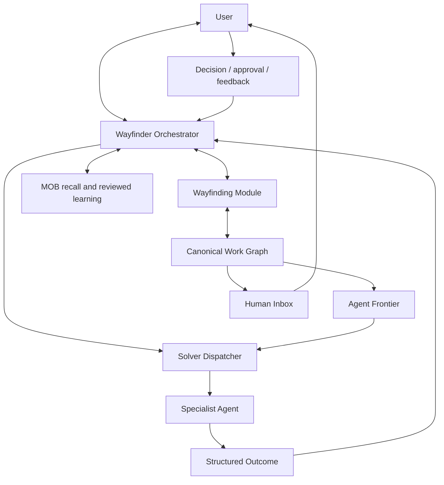

# Wayfinder control plane

Status: earlier conceptual baseline. The single-control-plane decision remains
accepted, while the Work Item lifecycle, Solver Outcome, and MOB sections are
refined by [`asterflow-blueprint.md`](asterflow-blueprint.md). No target
runtime implementation has been built.

## 1. Summary

Asterflow has one user-facing authority: the **Wayfinder Orchestrator**. It
uses the Wayfinder method for every task, maintains one canonical **Work
Graph**, assigns bounded **Work Items** to capability-specialized Agents, and
incorporates their structured results.

Wayfinder is therefore not one optional route among Direct, Grill, and
Wayfinder. It is the common control protocol. Direct work, human decisions,
research, implementation, diagnosis, prototyping, and verification are kinds
of Work Item within that protocol.



The recursive structure belongs to the Work Graph, not to control authority.
Specialist Agents may discover new uncertainty and propose children, but only
the Wayfinder Orchestrator can commit those changes.

## 2. Architectural invariants

The first implementation must preserve these rules:

1. There is one user-facing Orchestrator per active Destination.
2. There is one canonical Work Graph and one writer for it.
3. Specialist Agents receive one bounded Work Item at a time.
4. Specialist Agents return outcomes; they do not own lifecycle transitions.
5. A resolved child does not automatically resolve its parent.
6. Completion requires evidence against the Destination's acceptance
   conditions.
7. Live coordination state is stored outside model conversation history.
8. Agent Frontier and Human Inbox are derived projections, not separate
   sources of truth.
9. A blocked branch does not stop independent ready branches.
10. MOB failure may reduce recall and learning, but cannot stop task
    execution.

## 3. Wayfinder as the Orchestrator protocol

Every user request enters the same conceptual loop:

1. Pin the Destination and observable acceptance conditions.
2. Recall a small amount of relevant, reviewed knowledge from MOB.
3. Inspect the current Work Graph.
4. Determine whether the current Work Item is directly executable.
5. If not, expand only enough of the graph to expose a useful frontier.
6. Assign ready Work Items to suitable Specialist Agents.
7. incorporate outcomes, evidence, and user decisions.
8. Verify children and synthesize parents.
9. Report progress, blockers, and required user actions.
10. Deliver only when the Destination is demonstrably satisfied.

Simple work still passes through this protocol but may produce an ephemeral,
single-node graph. Persistence and ceremony scale with uncertainty, duration,
and coordination needs rather than being mandatory for every request.

## 4. Work Graph

The Work Graph carries two relationships:

- parent-child edges explain why a Work Item exists and form the readable
  specification tree;
- dependency edges determine when a Work Item can execute and form an
  execution DAG.

The graph should grow lazily. Creating every apparent leaf before research has
removed the Fog produces false precision and stale work. Expansion stops when
a Work Item can be completed and verified by one Agent in a bounded session.

Conceptually, a Work Item needs:

```ts
interface WorkItem {
  id: string;
  parentId: string | null;
  dependsOn: string[];

  kind:
    | 'direct'
    | 'decision'
    | 'research'
    | 'prototype'
    | 'spec'
    | 'implementation'
    | 'diagnosis'
    | 'verification';

  objective: string;
  acceptance: string[];
  evidenceRequired: string[];

  requirements: WorkRequirements;
  state: WorkState;
}
```

The exact persisted schema remains open. These fields describe the semantic
contract, not a committed TypeScript design.

## 5. Work Item lifecycle

The initial lifecycle should support at least:

```text
fog
  → ready
  → claimed
  → running
  → submitted
  → verifying
  → resolved
```

Alternate transitions include:

```text
running → awaiting-human
running → needs-decomposition
running → failed
claimed → ready              claim expired or was released
any non-final state → superseded
```

A Claim is a lease, not ownership. It identifies the Agent and graph revision
and expires so crashed or abandoned work can be recovered. A stale Agent
cannot overwrite a newer result.

When work pauses, the Agent produces a Checkpoint containing completed
progress, evidence, artifacts, assumptions, remaining work, and resume
conditions. Any compatible Agent can resume from it.

## 6. Specialist Agents and model selection

An Agent is an executable solver profile, not a personality:

```text
Model tier
+ capability declaration
+ Matt Skills whitelist
+ tools
+ permissions
+ context budget
+ input/output contract
+ escalation policy
```

Wayfinder describes the objective requirements of a Work Item. It does not
name a vendor model. The Solver Dispatcher chooses the cheapest Agent expected
to complete the work reliably after satisfying hard constraints for tools,
permissions, context, risk, and capability.

Useful initial profiles are:

| Profile | Intended work |
|---|---|
| Fast Worker | Explicit, local, low-risk, easily verified work |
| Researcher | External facts and read-only code exploration |
| Builder | Known programming work using bounded writes and TDD |
| Reasoner | Diagnosis, architecture, high uncertainty, difficult synthesis |
| Verifier | Independent evaluation against acceptance and evidence |

Model escalation happens after meaningful evidence such as failed
verification, unresolved Fog, repeated tool failure, or incompatible child
results. A low-price model is not appropriate merely because an action is
simple; high-risk actions still need stronger safeguards.

OMO supplies the Agent runtime: session creation, tool and permission binding,
background execution, cancellation, and result collection. Matt Skills supply
standard solving methods at Work Item granularity. Neither owns the Work
Graph.

## 7. Solver Interface

The key seam between the control plane and all Specialist Agents is:

```text
Work Item → Solver Outcome
```

Conceptually:

```ts
type SolverOutcome =
  | {
      status: 'submitted';
      conclusion: string;
      artifacts: ArtifactReference[];
      evidence: EvidenceReference[];
      assumptions: string[];
    }
  | {
      status: 'needs-decomposition';
      discoveredFog: string[];
      proposedChildren: ProposedWorkItem[];
    }
  | {
      status: 'blocked-by-human';
      proposedHumanAction: ProposedHumanAction;
      checkpoint: Checkpoint;
    }
  | {
      status: 'failed';
      failure: FailureRecord;
      recommendedEscalation?: Capability[];
    };
```

An Agent may propose changes but cannot commit them. The Orchestrator decides
whether to verify, retry, escalate, expand the graph, ask the user, or resolve
the Work Item.

## 8. Verification and synthesis

Two resolved children do not imply that their parent is resolved. Parent
synthesis must check:

- coverage of the parent's acceptance conditions;
- consistency between child assumptions and conclusions;
- integration of produced artifacts;
- remaining Fog;
- direct evidence from the real entry point where applicable.

Verification may itself be a Work Item assigned to an independent Verifier.
The Wayfinder Orchestrator remains the final state authority.

## 9. Agent Frontier and Human Inbox

There are not two independent todo databases.

The **Agent Frontier** is the internal projection of Work Items whose
dependencies are satisfied, that do not await the user, that have no write
conflict, and that are not already claimed.

The **Human Inbox** is the user-facing projection of Work Items requiring
irreducibly human input:

- product preference or value judgment;
- approval of a visual or interactive Artifact;
- authorization for a high-risk action;
- credentials, permission, or an external action;
- information unavailable from the environment or MOB.

Facts that an Agent can investigate must not consume human attention.

A Human Action should contain the exact request, why a human is needed,
options and trade-offs where applicable, a recommendation, the versioned
Artifact to inspect, affected Work Items, and the accepted response form.

Conversation may present one Human Action at a time even when the Inbox
contains several items.

## 10. Human AFK operation

User attention can operate in three modes:

| Mode | Behaviour |
|---|---|
| Live | Surface important Human Actions immediately |
| Critical only | Queue local actions; interrupt only for a global barrier |
| AFK | Queue all Human Actions and continue independent work |

When an Agent becomes blocked by the user:

1. it saves a Checkpoint and any versioned Artifact;
2. it submits a proposed Human Action;
3. the Orchestrator records `awaiting-human` on the affected branch;
4. the Claim is released;
5. the scheduler continues with another ready Work Item.

A local human barrier blocks only its dependent subtree. A global barrier
pauses the Destination only when no safe independent work remains or when the
decision controls all remaining branches.

After the user responds, the Orchestrator records the decision, reevaluates
affected assumptions, invalidates stale descendants when necessary, and
recomputes the Agent Frontier.

## 11. Artifact handling

Documents, pages, small programs, prototypes, patches, reports, and test
results are first-class Artifacts. A Human Action references an exact Artifact
version; later Agent work cannot silently replace the version awaiting review.

The Artifact reference must make clear:

- what question the Artifact tests;
- how the user can inspect it;
- which version is under review;
- which responses are supported;
- which Work Items the response will affect.

Storage and preview technology remain implementation choices.

## 12. MOB integration

MOB is a reviewed knowledge cache, not the live task coordinator.

Before charting or creating a Human Action, the Orchestrator may request a
compact recall of relevant confirmed decisions, known failures, reusable
steps, or research. Evidence is expanded only when selected.

Live graph nodes, claims, the Agent Frontier, Checkpoints, and Human Inbox stay
in task coordination storage. A user-confirmed decision or reusable
Resolution may produce a MOB learning-signal candidate. Unresolved,
generalizable questions may produce a `research-question` candidate. They do
not enter canonical memory without review.

## 13. Context and prompt-cache discipline

The Work Graph cannot live only in the Orchestrator's chat history. Progress
responses must be generated from a current graph snapshot, not from model
memory.

Specialist Agents receive only the Work Item, relevant ancestor invariants,
selected evidence, and required output contract. They do not receive the
entire graph or other Agent transcripts.

Dynamic frontier and progress information must be injected at the trailing
volatile portion of the outgoing payload so OMO-Slim's provider prompt-cache
prefix remains stable.

## 14. Deep Module shape

The Wayfinding Module should hide graph invariants, lifecycle transitions,
claim recovery, projection derivation, and consistency checks behind a small
Interface:

```ts
interface WayfindingModule {
  inspect(reference: MapReference): Promise<WayfindingSnapshot>;
  apply(command: WayfindingCommand): Promise<TransitionResult>;
}
```

Storage is an internal seam. The first durable Adapter is a project-local
Markdown directory. Each task handoff uses a stable task number plus a short
identifier in its filename, for example `042--wayfinder-state-model.md`.
An in-memory Adapter supports tests; GitHub may become a later Adapter if
multi-user synchronization is genuinely required.

The interface, rather than internal data structures, is the primary test
surface.

## 15. Superseded early framing

The earlier research described Direct, Grill, and Wayfinder as three top-level
routes. The current decision supersedes that framing:

- Wayfinder is always the control protocol;
- Direct is an immediately executable Work Item;
- Grill produces or resolves a Human Action;
- Research, prototype, implementation, diagnosis, and verification are other
  Work Item kinds;
- persistence depth adapts to the task.

The research documents remain useful as source analysis and as a record of how
the architecture evolved.

## 16. Open design questions

The next session should decide:

1. What is the minimum persisted Work Item schema?
2. Which lifecycle transitions belong in the first vertical slice?
3. What minimum Markdown frontmatter is required for reliable lookup and
   resume?
4. How are write-scope conflicts represented and detected?
5. How does the Orchestrator choose between deterministic routing and a model?
6. What is the minimum Human Inbox interface for prototype review?
7. Which OMO-Slim modules should be reused, adapted, or replaced?
8. What events are required for replay, audit, and progress reporting?

## 17. Recommended first vertical slice

Build a local-only, single-process demonstrator:

1. create one Destination and a small Work Graph;
2. derive an Agent Frontier and Human Inbox;
3. claim one Work Item;
4. accept one structured Solver Outcome;
5. create a Checkpoint and Human Action;
6. resolve that action and unlock dependent work;
7. verify the root Destination;
8. recover the same state after process restart.

Use an in-memory Adapter for tests and one project-local Markdown Adapter for
the demonstrator. Defer GitHub synchronization, full Dream automation, broad
Agent catalogues, and elaborate UI until the state model is proven.
