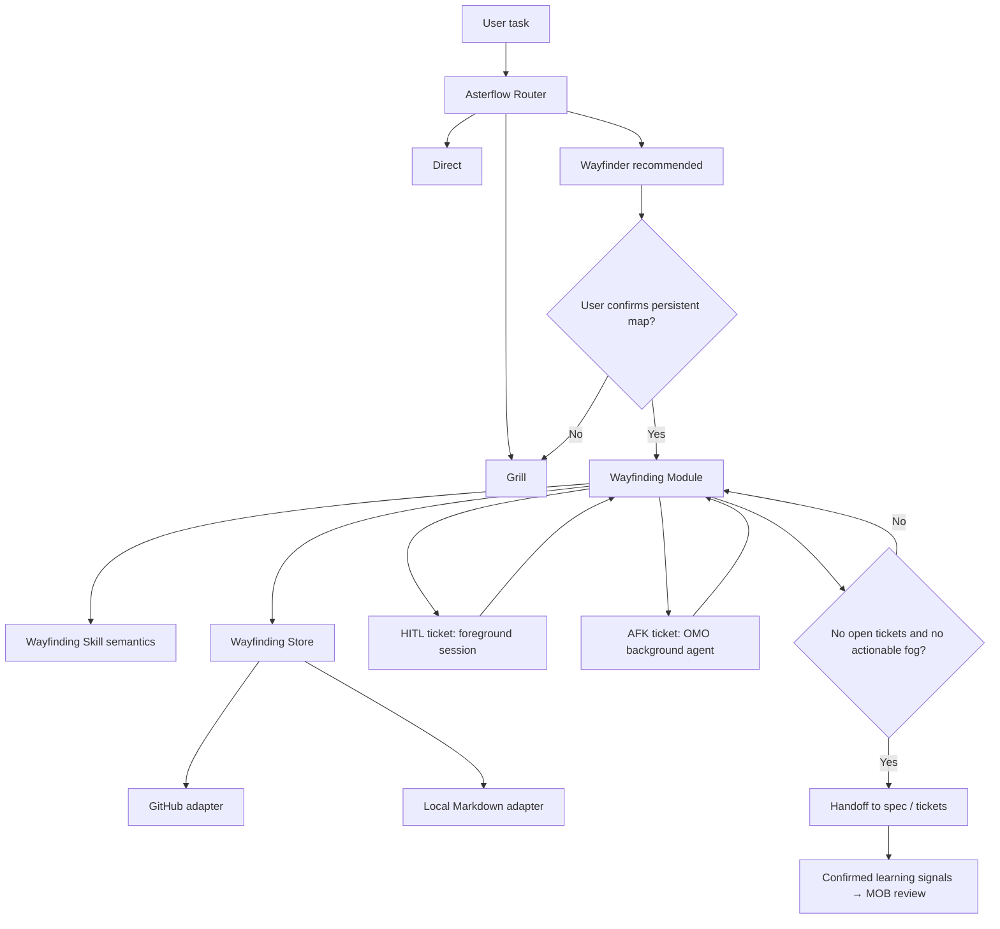

# Asterflow Wayfinder 融合专项研究

调研日期：2026-07-26

本报告研究如何把 Matt Pocock Skills 的完整 Wayfinder 能力融入
Asterflow，而不是把它简化成普通代码探索 Agent。事实依据来自 Matt Skills、
OMO-Slim、OpenCode、GitHub 和 MyOutBrain 的一手文档与源码；带有
“建议”或“推论”的内容属于 Asterflow 设计判断。

## 1. 结论

Wayfinder 值得成为 Asterflow 的三个顶层入口之一，但它应当是一种**持久工作流
模式**，不是一个人格化 Agent，也不能只是一段更长的 Prompt。

推荐采用 hybrid：

1. Matt Wayfinder Skill 保留语义判断：
   Destination、Fog、Decision Ticket、Frontier、HITL/AFK、何时交给 spec。
2. Asterflow 原生 Wayfinding Module 负责可检测机械不变量：
   读取地图、计算 Frontier、认领、阻塞关系、幂等更新、恢复和完成门槛。
3. Issue tracker 或本地 Markdown 保存 live map，是运行事实源。
4. OMO Background Job Board 只镜像正在运行的 AFK research，不保存地图。
5. MOB 只接收已确认决定、研究问题等学习信号，不保存 live map，也不自动批准。



## 2. Wayfinder 真正提供了什么

Matt Wayfinder 面向“超过一个 Agent session、到 Destination 的路径仍被雾包围”
的工作。它默认规划而不实现，通过共享 map 和 decision tickets 逐步清除雾区
([Wayfinder Skill](https://github.com/mattpocock/skills/blob/ed37663cc5fbef691ddfecd080dff42f7e7e350d/skills/engineering/wayfinder/SKILL.md))。

它的核心不在名字，而在以下协议：

- **Destination first**：创建 ticket 前先确定目的地，以此固定范围。
- **Map is an index**：地图只保存已决事项的摘要指针，不重复 ticket 中的答案。
- **Fog of war**：现在还不能精确表达的问题留在 `Not yet specified`。
- **Frontier**：所有 open、unblocked、unclaimed tickets。
- **Blocking edges**：决策依赖显式进入 tracker。
- **Claim before work**：session 在工作前先认领 ticket。
- **One ticket per session**：charting 单独占一个 session；通常每个后续 session
  只解决一个 ticket，research tickets 例外。
- **HITL / AFK**：Grilling、Prototype 不能由 Agent 代替用户回答；Research
  可以后台运行。
- **No-fog exit**：如果初始广度探索没有发现雾，就不创建地图。
- **Handoff, don't build**：地图清晰后进入 `to-spec`，默认不直接实现。

Matt 的发布记录明确把 Wayfinder 定位为 situational on-ramp，而不是所有任务的
默认主流程；把它提升为默认骨架被作者称为一次 “v2-sized move”
([CHANGELOG](https://github.com/mattpocock/skills/blob/ed37663cc5fbef691ddfecd080dff42f7e7e350d/CHANGELOG.md))。

对 Asterflow 的推论是：可以把 Wayfinder 提升为三路 Router 的正式入口，但必须
保留严格阈值，不能让“任务有点复杂”就生成持久地图。

## 3. 三路 Router 应如何重新定义

原先把 Direct 理解为“主 Agent 能在当前 session 独自完成”过窄。融合 Wayfinder
后，更稳定的划分轴是**路径可见度**与**决策跨度**：

| 入口 | 判断 |
|---|---|
| Direct | 可观察结果和到达路径已经足够清楚；可以直接实现，也可以内部调用 Scout、Builder、TDD 或已明确的 spec/tickets 流程 |
| Grill | 存在必须由用户决定的分支，但决策树可以在当前 session 内走完 |
| Wayfinder | Destination 可以被钉住，但到达路径仍有跨 session 的决策雾区 |

结构事实未知并不自动等于 Wayfinder。入口、调用链或第三方 API 未知时，Direct
可以先运行只读 Scout/Research；只有这些事实背后仍存在无法在一个 session
容纳的决策图时，才升级 Wayfinder。

建议 Router 只产生 `wayfinder_recommended`，不直接执行第一次持久写入。创建
map、issues、blocking edges 属于可见外部状态变化，应在用户确认后进入
Wayfinder。用户直接运行 `/wayfinder` 或引用已有 map 时，已经构成显式授权。

## 4. 三种接入形态

### 4.1 原样安装 Skill

做法：

- 固定 Matt Skills commit；
- 安装 `wayfinder` 和 tracker setup 文档；
- 让模型按 Skill 文本直接操作 GitHub 或 `.scratch/`。

优点：

- 最快可用；
- 最大程度保持上游语义；
- 很适合作为第一轮 dogfood。

缺点：

- 状态转换只能靠模型遵守；
- claim、resolution、fog graduation 不能独立测试；
- 三步 resolution 中途失败时难以恢复；
- OpenCode 的调用边界和 Matt 原生环境不完全一致。

结论：适合实验，不适合作为最终 harness 契约。

### 4.2 完整原生状态机

做法：

- 在插件内重新实现 map、ticket、fog、frontier 和 tracker；
- Skill 仅剩用户文档。

优点：

- 行为最确定；
- 可以完整测试并提供专用 UI。

缺点：

- 容易重写 Matt 仍在演变的语义；
- 插件状态可能与 GitHub、Markdown 形成双事实源；
- 首版接口很可能暴露过多内部状态，成为浅 Module；
- 建设成本会延迟真实 Wayfinder 使用反馈。

结论：当前不采用。

### 4.3 Hybrid：Skill + 原生 Wayfinding Module

做法：

- Skill 负责语义推理和人机协作；
- Wayfinding Module 负责确定性读取与状态转换；
- tracker adapter 保存 canonical live map；
- Orchestrator 只通过 Module interface 修改地图。

优点：

- 保留上游方法；
- 把高风险机械步骤集中在一个可测试 seam；
- GitHub 与本地 Markdown 可以共享同一领域规则；
- 后续可以更换 UI、tracker 或 Skill 版本而不改调用者。

缺点：

- 需要先定义 revision、idempotency 和修复协议；
- GitHub 多对象写入不能真正原子化；
- 必须明确哪些判断仍属于模型。

结论：推荐目标架构。

## 5. 推荐 Module 与 Interface

### 5.1 外部 Interface

Wayfinding Module 应是一个深 Module：Orchestrator 只学习两个入口，大部分复杂性
留在实现内部。

```ts
interface WayfindingModule {
  inspect(reference: MapReference): Promise<WayfindingSnapshot>;

  apply(command: WayfindingCommand): Promise<TransitionResult>;
}
```

`inspect` 是只读测试面，返回：

- Destination 和 map reference；
- 当前派生 phase；
- decisions index；
- fog 摘要；
- frontier、blocked、claimed tickets；
- 当前 revision；
- 下一步允许的 commands。

`apply` 接受 discriminated union：

```ts
type WayfindingCommand =
  | ChartMap
  | ClaimTicket
  | ResolveTicket
  | ReturnClaim
  | AddTickets
  | RuleOutOfScope
  | CompleteMap
  | RepairTransition;
```

每个写 command 必须携带：

- `expectedRevision`；
- 稳定 `idempotencyKey`；
- actor/session identity；
- command 所需的最小语义 payload。

接口不暴露 GitHub issue body 拼接、文件路径、API 顺序、缓存或恢复 journal。

### 5.2 内部 Store seam

```ts
interface WayfindingStore {
  load(reference: MapReference): Promise<StoredMap>;
  commit(batch: StoreMutationBatch): Promise<StoreCommitResult>;
}
```

这是一个真实 seam，因为至少存在：

- `GitHubWayfindingStore`；
- `LocalMarkdownWayfindingStore`；
- `InMemoryWayfindingStore`（测试）。

Module 负责领域不变量，Store adapter 负责传输和持久化。测试应从
`WayfindingModule` 外部 Interface 观察行为；adapter 契约测试另行验证。

## 6. 哪些判断属于 Skill，哪些属于 Module

| 判断或动作 | 所有者 |
|---|---|
| 如何描述 Destination | Skill + 用户 |
| 某个未知是否已经能精确写成问题 | Skill |
| Ticket 类型是 Research、Prototype、Grilling 还是 Task | Skill |
| 研究结果是否足以支持决定 | Skill + 用户 |
| Ticket 是否 open/unblocked/unclaimed | Module |
| Frontier 计算 | Module |
| Blocking graph 是否引用不存在的 ticket 或形成非法边 | Module |
| Claim 是否仍有效 | Module |
| Resolution 是否已经幂等提交 | Module |
| Map index 是否只含一个指向 resolved ticket 的摘要 | Module |
| Fog 项毕业后是否从原位置删除 | Module |
| 是否没有 open ticket | Module |
| 剩余 fog 是否仍可行动 | Skill 判断，Module 记录 |
| 是否允许进入 `to-spec` | Module 硬门槛 + Skill 语义确认 |

删除 Wayfinding Module 后，这些校验会重新散落到 command prompt、GitHub 调用、
Markdown 编辑和恢复代码中，因此这个 Module 具有足够 Depth 和 Locality。

## 7. Invocation policy

Matt Skill 使用 `disable-model-invocation: true`，但 OpenCode V1 只识别有限
frontmatter 字段，未知字段会被忽略
([OpenCode Skills](https://opencode.ai/docs/skills/))。OpenCode V2 已增加
`metadata.opencode/autoinvoke: false`，可以把 Skill 从模型发现列表移除，同时
保留 slash command
([OpenCode V2 Skills](https://opencode.ai/v2/docs/skills))。

OMO 当前主要通过 per-Agent skill permissions 和
[`filter-available-skills`](../../upstreams/oh-my-opencode-slim/src/hooks/filter-available-skills/index.ts)
过滤模型可见 Skill。它把“是否可见”和“是否授权”部分混在一起。

建议 Asterflow 建立独立 invocation policy：

| Policy | 行为 |
|---|---|
| `explicit-only` | 只有用户 slash command 或已存在 map reference 能激活 |
| `recommend-only` | Router 知道触发条件并可以建议；用户确认后激活 |
| `auto` | 模型可以自行加载并执行 |

Wayfinder 使用 `recommend-only`。底层实现：

- OpenCode V2 使用 `opencode/autoinvoke: false`；
- 旧版通过 Prompt 可见性 Hook 隐藏 Skill；
- `/wayfinder` 由 OMO 已有 `command.execute.before` 模式注册；
- Router Prompt 只包含简短触发规则，不注入完整 Skill 正文。

## 8. Session、HITL 与后台 Agent

Wayfinder 需要覆盖 OMO 默认的 session reuse 偏好：

- Chart map 使用一个前台 session，结束时不顺手解决 ticket。
- 每个普通 decision ticket 使用新的前台 context。
- 不复用已经解决其他 ticket 的 specialist session。
- 每个 session 只加载 low-resolution map 和当前 ticket，按需 zoom。
- Research tickets 可以并行派发新的后台 Agent。

HITL tickets 必须留在能直接等待用户的前台：

- Grilling 一次一问，不能由子 Agent 自问自答；
- Prototype 必须让用户看到并反馈；
- 需要人工操作的 Task 使用明确等待状态。

OMO Background Job Board、task session manager 和 cancellation 可以复用来管理
AFK Research，但 Background Job Board 是进程内会话状态，不是 live map 事实源
([task-session-manager codemap](../../upstreams/oh-my-opencode-slim/src/hooks/task-session-manager/codemap.md))。

OMO Interview 的 command registration、Markdown 恢复和 dashboard 可以成为
Wayfinder HITL 的后续 UI adapter
([interview codemap](../../upstreams/oh-my-opencode-slim/src/interview/codemap.md))，
但不应拥有 map 语义。

## 9. Live map 应保存在哪里

| 位置 | 结论 |
|---|---|
| GitHub Issues | 协作首选；原生 sub-issues、dependencies、评论和可视化，但需要外部写权限 |
| Local Markdown | 离线与首轮 dogfood 首选；易审查、可 Git 跟踪，但跨进程认领更弱 |
| OMO plugin memory | 拒绝；重启和多客户端后不可靠 |
| Background Job Board | 拒绝；只保存运行 session |
| MOB canonical memory | 拒绝；live planning state 不是长期规范知识 |

GitHub 已提供 sub-issues 和 issue dependency REST endpoints
([Sub-issues](https://docs.github.com/en/rest/issues/sub-issues)，
[Issue dependencies](https://docs.github.com/en/rest/issues/issue-dependencies))，
因此 tracker adapter 不需要自己复制关系图。

首轮建议使用 `.scratch/<effort>/map.md` 和一票一文件；Module Interface 稳定后再
增加 GitHub adapter。这样可以先验证领域状态机，再承担远程权限和部分写入恢复。

## 10. 并发与崩溃恢复

Matt 原协议留下几个需要原生 Module 补强的可靠性问题。

### 10.1 Stale claim

GitHub assignee 表示开发者，而多个 Asterflow session 往往共享同一 GitHub
身份，无法区分具体 session。建议 claim 同时带：

- `claimToken`；
- `sessionID`；
- `claimedAt`；
- `leaseExpiresAt`。

Local adapter 可使用独占创建的 lock/journal。GitHub adapter 可以用结构化
comment 或隐藏 marker 保存 token；在没有可靠 compare-and-set 前，应限制同一
ticket 的跨进程并发，并且绝不自动偷取过期 claim，先显示恢复影响。

### 10.2 Resolution 不是原子写

上游顺序是：

1. 写 resolution comment；
2. close ticket；
3. 更新 map 的 Decisions-so-far。

任一步失败都会产生半完成状态。`apply(ResolveTicket)` 应内部实现 saga：

- 每步使用同一个 idempotency key；
- 持久记录完成步骤；
- 重试前读取真实 tracker 状态；
- 重复执行得到同一结果；
- `inspect` 能识别并返回 `repair-required`。

### 10.3 Optimistic concurrency

`expectedRevision` 可以是 local 文件集合 hash，或 GitHub map/ticket
`updated_at`、body hash 与关系快照组合。revision 不匹配时返回 conflict 和新
snapshot，不覆盖他人工作。

### 10.4 Completion detector

Module 只能确定：

- 没有 open tickets；
- 没有未完成 transition；
- blocking graph 一致；
- `Not yet specified` 是否为空。

“剩余雾是否已经不可行动或 Destination 是否真正清晰”仍需要 Skill 与用户确认。
因此 `CompleteMap` 是显式 command，不应仅因 ticket 数为零自动触发。

## 11. Prompt cache

Map 会在不同 session 和 turn 之间变化，不能重写早期消息。推荐：

- `/wayfinder` 激活时只注入稳定 map reference；
- 每个新 session 主动调用 `inspect`；
- 只加载 low-resolution snapshot 和当前 ticket；
- 动态 frontier 提醒若必须注入，只能通过 OMO
  [`cache-safe-injection.ts`](../../upstreams/oh-my-opencode-slim/src/hooks/cache-safe-injection.ts)
  的 trailing volatile message；
- 不把完整 map、所有 tickets 或 MOB evidence 放入 system prompt。

这同时保留 Matt 的 “map is an index” 原则和 Provider byte-prefix cache。

## 12. MOB 边界

MyOutBrain 的学习信号包括 `confirmed-decision`、`research-question`、
`reusable-step`、`failure-and-resolution` 和 `user-correction`
([reflection.py](https://github.com/Devwallem/MyOutBrain/blob/0734b45acab58c90f0347055fafce1d0ba119d4d/src/myoutbrain/reflection.py))。

Wayfinder 与 MOB 的正确关系：

- Charting 前按 Destination 做紧凑召回，减少重复 Fog；
- Research ticket 可以按 map/ticket reference 展开相关证据；
- 用户确认的 resolution 可以提交 `confirmed-decision` learning signal；
- 尚未解决的长期问题可以提交 `research-question`；
- source reference 指向 map/ticket 及其 revision；
- Dream/Reflector 生成审阅提案；
- 未经批准不写 canonical memory。

不得把 map、claim、frontier 或 open ticket 复制进 MOB。它们是短中期协调状态，
不是规范认知。

## 13. 可观察事件

建议 Wayfinding Module 发出结构化事件：

- `wayfinder.recommended`
- `wayfinder.entered`
- `map.charted`
- `ticket.created`
- `edge.added`
- `ticket.claimed`
- `ticket.returned`
- `ticket.resolved`
- `fog.graduated`
- `scope.ruled_out`
- `frontier.changed`
- `transition.repair_required`
- `map.ready_for_spec`
- `map.handed_off`

事件不保存语义全文，只保存 map/ticket references、revision、actor、结果和错误。
用户界面显示名称而不是裸 ID，符合 Wayfinder 原协议。

## 14. 最小验证场景

1. 初始 Grill 没有 Fog：不创建 map。
2. 未确定 Destination：禁止创建 ticket。
3. 创建 tickets 后，Frontier 只含 open、unblocked、unclaimed 项。
4. Blocker 解决后，下游 ticket 自动进入 Frontier。
5. 两个 session 同时 claim：最多一个成功，另一个收到新 snapshot。
6. HITL ticket 没有真实用户输入：禁止 resolution。
7. Research tickets 可并行，失败不会误解锁下游。
8. Resolve 在每个写入步骤崩溃后都能幂等恢复。
9. Fog graduation 后内容只存在于新 ticket，不在 map 重复。
10. Out-of-scope ticket 永不进入 Frontier 或 Decisions-so-far。
11. 重启插件后从 tracker 重建完全相同的 snapshot。
12. 一个普通 session 不会解决第二个非 research ticket。
13. 无 open tickets 但仍有 actionable Fog：禁止完成。
14. 完成 map 后只 handoff 到 spec，不自动实施。
15. Dynamic snapshot 不改变 Prompt 的稳定 byte prefix。
16. MOB 不可用时 Wayfinder 仍工作，只缺少召回和学习信号。

## 15. 分阶段融合

### Phase 0：原样 dogfood

- 固定 Matt commit 和许可证归属；
- 安装 Wayfinder Skill 与 local tracker conventions；
- 使用 `/wayfinder` 规划 Asterflow 自身；
- 手工记录违反协议、重复操作和恢复问题。

### Phase 1：只读 Inspector

- 实现 `inspect` 和 `InMemoryWayfindingStore`；
- 解析 local map/tickets；
- 确定性计算 Frontier、blocking 和 inconsistencies；
- Skill 仍直接写 Markdown。

### Phase 2：受控 Local Mutations

- 实现 `apply`、revision、idempotency 和 repair journal；
- 所有 local map 写入必须穿过 Module；
- 完成上述最小验证场景。

### Phase 3：GitHub Adapter

- 加入 sub-issues、dependencies、assignee/claim marker；
- 契约测试 local 与 GitHub snapshot 等价；
- 增加外部写权限与 dry-run 展示。

### Phase 4：Router 与 MOB

- 加入 `recommend-only` invocation policy；
- 记录 route recommendation 和用户确认；
- 接入 task-scoped MOB recall 与 confirmed learning signals；
- 保持 Wayfinder 在 MOB 失败时可降级工作。

## 16. 最合适的下一步实验

不要先实现完整 Module。先用原版 Wayfinder 规划 Asterflow 自己，Destination 可以
暂定为：

> 形成一份足以开始实现 Asterflow 最小控制平面的架构规格，明确 Router、
> Wayfinding Module、Verifier 和 MOB adapter 的 Interface 与验证 seam。

这个实验会同时回答：

- Wayfinder 的 Fog/Frontier 是否真的适合当前项目；
- 哪些机械错误实际发生，值得下沉进 Module；
- local Markdown 是否足以支撑首版；
- 哪些决策应该进入 MOB；
- 从清图到 spec 的 handoff 是否损失信息。

只有经过这次 dogfood 后，才应固定原生 Interface。否则我们可能为了想象中的
可靠性建立一个很完整、却没有承载真实复杂度的浅状态机。
