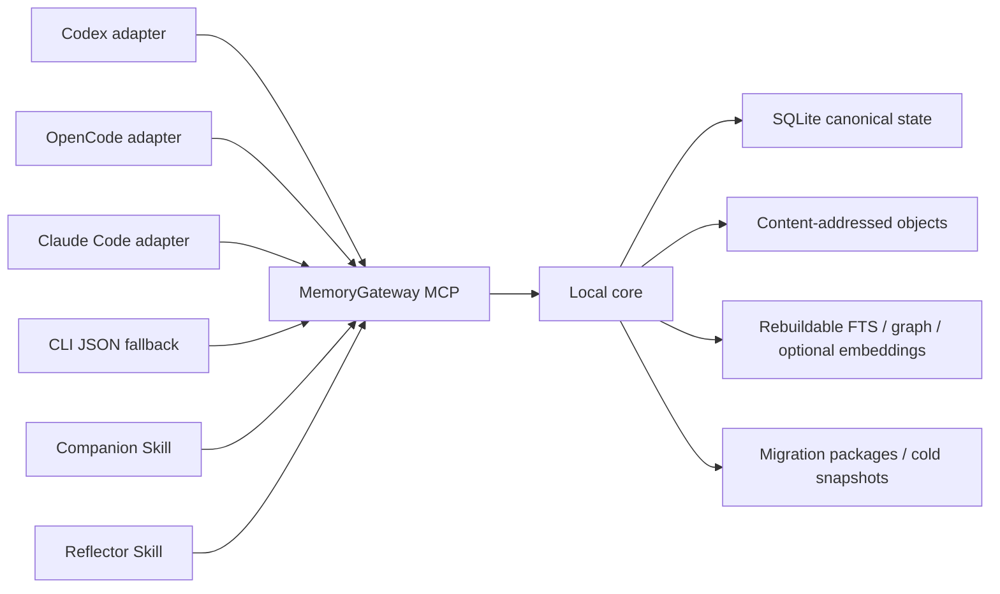
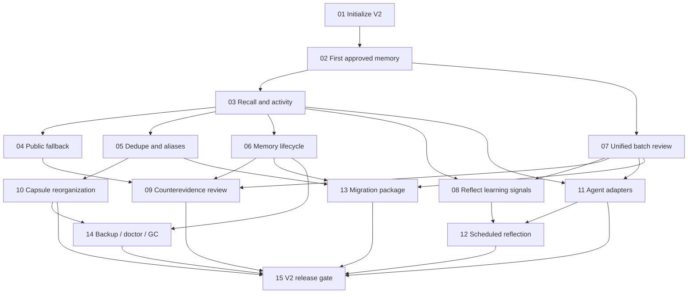

# MyOutBrain V2：可迁移的个人知识闭环

Status: ready-for-agent

## Problem Statement

MyOutBrain 已验证来源采集、候选审阅、记忆缓冲、知识召回与 Codex 同伴入口，但现有实现和第一阶段设计仍把若干生命周期分散在 Vault、运行投影、候选队列与客户端逻辑中。随着知识增长，这会放大三个问题：细碎知识难以局部召回；证据、历史知识和新反证容易被复制或静默改写；Codex、OpenCode 与 Claude Code 难以共享同一套可靠状态。

V2 要把个人知识库定义为“创作者过去采纳过、带时间与适用范围的理解”，而不是永恒真理。知识可以变旧、受到反证或被取代，但只有创作者经过统一审阅后才能改变其持久状态。系统可以大胆召回历史可信知识、公开证据和冲突线索，却不能自动投票、衰减权重或清除知识。

V2 同时需要控制规模：正文只保存一份，证据按内容寻址，关系数量近似线性；详细知识由稳定字典定位到自适应分区树的有界知识胶囊。智能体默认只取得与当前任务相关的紧凑召回包，证据在确有核验需要时再展开。

## Solution

交付一个项目无关、单创作者、本地优先的主私人实例。Codex、OpenCode、Claude Code 通过可替换入口共享同一核心。任何兼容入口都能完成以下闭环：

1. 召回当前任务所需知识并记录召回动向。
2. 在证据不足、过时或冲突时保持未知或补充允许范围内的公开信息。
3. 从任务中的明确学习信号生成统一审阅提案。
4. 由创作者批次修改、批准、拒绝或延期。
5. 按提案意图物化为规范记忆、人类归档或研究线程。
6. 通过手动 ZIP 在实例间迁移经审计的知识闭包，并能以整库 ZIP 快照恢复。

## User Stories

1. As a single creator, I want one project-independent private instance, so that changing projects does not fragment my knowledge.
2. As a single creator, I want Codex, OpenCode and Claude Code to share one local core, so that switching agents does not make the companion forget.
3. As a single creator, I want client adapters to contain no canonical state, so that I can replace or reinstall them safely.
4. As a single creator, I want the system to work without a resident daemon, so that ordinary use remains lightweight.
5. As a single creator, I want a clean V2 initialization path, so that an empty architecture-stage instance is not constrained by V1 compatibility.
6. As a single creator, I want every memory to have a stable identity independent of its name, so that renaming and reorganization cannot break links.
7. As a single creator, I want knowledge names and aliases to collide safely, so that identical words in different fields are not merged accidentally.
8. As a single creator, I want old names to redirect after a rename, so that existing references continue to work.
9. As a single creator, I want detailed knowledge listed in a knowledge dictionary, so that exact lookup remains fast.
10. As a single creator, I want broad knowledge partitions to split as they grow, so that mathematics can later become discrete mathematics, number theory and other bounded areas.
11. As a single creator, I want sparse related partitions to merge, so that the tree does not become permanently fragmented.
12. As a single creator, I want related memory bodies grouped into bounded knowledge capsules, so that thematic recall reads a small local region.
13. As a single creator, I want each memory body to have one primary capsule, so that cross-topic recall does not duplicate canonical text.
14. As a single creator, I want ambiguous cross-topic knowledge referenced from several partitions, so that one-primary-copy storage does not reduce discoverability.
15. As a single creator, I want capsule maintenance to preserve memory identity and meaning, so that storage optimization cannot become a semantic edit.
16. As a single creator, I want pinned and named partitions respected, so that automatic maintenance does not erase useful human organization.
17. As a single creator, I want memory, capsule and recall byte budgets, so that database growth and agent context stay bounded.
18. As a single creator, I want excess detail kept in evidence rather than canonical memory, so that stored understanding remains compact.
19. As a single creator, I want identical source bodies stored once, so that repeated use grows relationships rather than content copies.
20. As a single creator, I want existing local sources referenced by stable identity and locator, so that evidence is not duplicated or tied to OS symlinks.
21. As a single creator, I want every long-term memory to retain minimum provenance, so that later verification remains possible.
22. As a single creator, I want evidence retained as full text, excerpt or receipt according to need, so that ordinary evidence does not require permanent raw archives.
23. As a single creator, I want knowledge dependencies to terminate in real provenance, so that one memory cannot justify another in a circular chain.
24. As a single creator, I want a navigable evidence relationship map, so that changing a source reveals every affected memory.
25. As a single creator, I want the relationship map rebuilt from canonical edges, so that a damaged index is not a knowledge loss.
26. As a single creator, I want historically trusted knowledge to remain recallable, so that prior accepted understanding is not erased merely by age.
27. As a single creator, I want historical knowledge clearly distinguished from the current baseline, so that it can inform without pretending to be current.
28. As a single creator, I want knowledge state represented by a small closed set, so that labels do not grow into another classification system.
29. As a single creator, I want knowledge, experience, skill and research idea shown as dynamic views, so that one memory can serve different tasks without permanent type duplication.
30. As a single creator, I want no persistent knowledge weight, so that time and opaque scoring do not silently demote accepted knowledge.
31. As a single creator, I want exact dictionary lookup before fuzzy recall, so that known identities are deterministic.
32. As a single creator, I want the partition tree to narrow recall, so that most questions touch only a few capsules.
33. As a single creator, I want local and bounded global full-text search, so that a wrong tree route does not hide relevant knowledge.
34. As a single creator, I want Embedding to be an optional fallback, so that V2 works without model downloads or vector infrastructure.
35. As a single creator, I want the first recall package to contain compact knowledge rather than full evidence, so that ordinary answers remain economical.
36. As a single creator, I want evidence expanded only when verification needs it, so that provenance does not consume every context window.
37. As a single creator, I want answerability judged against my actual question, so that the core does not fake semantic certainty.
38. As a single creator, I want unresolved material counterevidence enforced as a hard constraint, so that an agent cannot ignore known conflicts.
39. As a single creator, I want the system to remain unknown when evidence is insufficient, so that fluent output is not mistaken for a conclusion.
40. As a single creator, I want knowledge-base-grounded answers identified briefly, so that I know when an explanation comes from MyOutBrain.
41. As a single creator, I want conclusions by default and evidence on request, so that normal conversation stays natural.
42. As a single creator, I want every recall recorded compactly, so that I can observe which knowledge is active in my work.
43. As a single creator, I want recall logs to omit full prompts and bodies, so that observability does not duplicate the knowledge base.
44. As a single creator, I want recall activity separated from change audit, so that reading and mutation histories answer different questions.
45. As a single creator, I want the companion to capture only explicit learning signals, so that message volume does not create review noise.
46. As a single creator, I want no reflection record for an uneventful task, so that automation does not accumulate empty summaries.
47. As a single creator, I want queued reflection to keep only minimal excerpts and stable references, so that weekly review does not require full conversation retention.
48. As a single creator, I want a weekly routine reflection batch, so that ordinary insights can be reviewed together.
49. As a single creator, I want blocking counterevidence delivered immediately, so that high-risk work does not continue on a known conflict.
50. As a single creator, I want scheduled reflection to wait for an available agent, so that the local core never calls a model silently.
51. As a single creator, I want one unified proposal queue, so that derivation, integration, archive and research decisions share one review surface.
52. As a single creator, I want proposal intent preserved, so that approving an archive cannot accidentally modify canonical knowledge.
53. As a single creator, I want explicit, derived and hypothetical proposal formation distinguished, so that model inference never masquerades as my statement.
54. As a single creator, I want exact proposals deduplicated and near variants grouped, so that review stays compact without losing distinctions.
55. As a single creator, I want contradictions grouped without majority voting, so that repeated claims cannot manufacture truth.
56. As a single creator, I want independent batch items to succeed separately and dependent groups atomically, so that one failure does not waste safe decisions or create half-changes.
57. As a single creator, I want personal cognition confirmed item by item, so that approve-all cannot define my identity.
58. As a single creator, I want routine proposals compacted after their review window, so that abandoned generated text does not grow forever.
59. As a single creator, I want rejected ideas to reappear only with materially new evidence, so that the companion does not nag me with duplicates.
60. As a single creator, I want discovered counterevidence to create a review proposal without changing memory, so that I remain the authority over persistent updates.
61. As a single creator, I want approved revisions to preserve old versions and reasons, so that changes in understanding remain auditable.
62. As a single creator, I want “forget” to deactivate by default, so that ordinary control remains reversible.
63. As a single creator, I want permanent erasure to require an impact-closure confirmation, so that deletion does not leave hidden derivatives.
64. As a single creator, I want MCP and CLI to expose the same domain operations, so that agents and automation have one behavioural contract.
65. As a single creator, I want protocol capabilities negotiated before writes, so that an old adapter cannot approve an effect it does not understand.
66. As a single creator, I want write operations idempotent and version-checked, so that retries and concurrent clients cannot duplicate or overwrite changes.
67. As a single creator, I want adapters installed and removed independently, so that client maintenance cannot touch my private instance.
68. As a single creator, I want a doctor command to diagnose core, data and adapter compatibility, so that portable installation remains understandable.
69. As a single creator, I want selected knowledge exported with its complete provenance closure, so that transferred knowledge is not stripped of support.
70. As a single creator, I want migration blocked when a dependency is restricted or missing, so that portability cannot silently degrade integrity.
71. As a single creator, I want migration imports previewed and idempotent, so that manual ZIP transfer can be repeated safely.
72. As a single creator, I want import conflicts sent to the unified review queue, so that another instance cannot overwrite local understanding.
73. As a single creator, I want backup to mean a simple full-directory ZIP, so that recovery remains easy to understand and perform manually.
74. As a single creator, I want restore performed into a new directory and verified, so that a bad backup cannot overwrite the last usable instance.
75. As a single creator, I want doctor to repair only rebuildable projections, so that it cannot invent missing canonical knowledge.
76. As a single creator, I want orphan source deletion previewed as a garbage-collection plan, so that historical evidence is not mistaken for temporary waste.
77. As a single creator, I want V2 usable without network access, so that the personal knowledge loop remains local-first.
78. As a single creator, I want the complete loop tested through black-box CLI and MCP scenarios, so that internal refactors do not weaken user-visible guarantees.
79. As a single creator, I want the same release scenarios run across all three agent entrances, so that portability is proven rather than claimed.
80. As a single creator, I want recall regression tests before capsule switches, so that automatic reorganization cannot quietly reduce memory quality.

## Implementation Decisions

## System Context

本地核心拥有领域状态、单写者协调、事务、计划运行、日志和通知。Skill 只编排一次有界智能体运行；入口适配器只翻译客户端扩展机制；能力引擎只进行当前任务需要的语义理解，不直接读写数据库。

## Invariants

- 一个主私人实例只有一个规范写入核心；所有入口共享它。
- `memory_id` 是知识身份，名称、别名、路径和胶囊位置均可变化。
- 每条当前规范记忆正文只有一个当前版本和一个主知识胶囊；跨主题只保留引用。
- 证据正文按内容哈希保存一次；完全重复知识去重，新增来源只合并关系。
- 规范知识、生命周期状态和语义关系只因明确审阅决定改变。
- 反证发现影响当前可回答性并生成提案，但不自动修改持久知识。
- 树摘要、FTS、Embedding、证据关系图和 Obsidian 视图均不是事实来源。
- 历史可信知识始终可召回；时间流逝本身不删除、不停用也不继续降权。
- 系统不保存知识权重；状态由封闭枚举表达，其他标签尽量动态推导。
- 普通使用在无 Embedding、无网络、无常驻进程时仍能完成基础闭环。

## Canonical Data Model

### Knowledge and structure

- `Memory`：稳定身份、当前版本、单一生命周期状态和审计版本。
- `MemoryVersion`：紧凑规范正文、适用时间与范围、作者归属和来源关系；目标不超过 4 KiB，硬上限 8 KiB。
- `MemoryName`：规范名称、别名、规范化形式和重定向；名称可碰撞，查询返回候选而不静默任选。
- `PartitionNode`：分区树内部路由节点或叶节点，保存主题范围、紧凑摘要、父子关系与用户固定约束。
- `Capsule`：叶节点下的逻辑分组，目标约 64 KiB、硬上限 128 KiB；SQLite 以独立正文记录通过 `capsule_id` 聚合，不保存整体大对象。
- `CrossReference`：让一条知识参与其他分区召回，不复制正文，也不充当知识依赖。

生命周期状态初始仅为 `current`、`historical-trusted`、`superseded`、`inactive`。冲突由未决反证关系推导，外部未整合属于证据或提案状态；知识、经验、技能和研究灵感属于当前展示视角。

### Evidence and relationships

- `Source` 与 `SourceVersion` 保存稳定来源身份、版本、定位器、内容哈希、时间、可见范围和迁移属性。
- `EvidenceObject` 在内容寻址对象存储中保存 `full` 或 `excerpt` 正文；`receipt` 只保留足以重新定位的凭证。
- 已有本地来源使用 `source_id + source_version + locator` 引用，不使用操作系统软链接，不复制正文。
- 持久关系仅保存 `supports`、`contradicts`、`derived-from`、`validated-by`、`depends-on` 和 `supersedes` 等明确边；双向证据关系图是可重建投影。
- 知识依赖最终必须抵达非循环来源凭证；迁移与删除均按传递闭包检查。

### Proposals and reflection

- `LearningSignal` 只表达用户纠正、已确认决策、可复用步骤、重复失败及解决、或待研究问题。
- `ReflectionInput` 是等待处理的临时最小摘录、稳定引用、来源指纹和盲区；提案形成后清理。
- `ReflectionRun` 保存触发原因、冻结范围、协议版本、领取租约、结果和重试状态。
- `ReviewProposal` 使用统一结构，意图为 `derive`、`integrate`、`archive` 或 `research`，形成方式为 `explicit`、`derived` 或 `hypothesis`，优先级为 `blocking`、`priority` 或 `routine`。
- `ReviewBatch` 冻结待审提案版本。独立项可幂等部分成功，显式依赖组必须原子应用。

提案包含稳定身份与版本、意图、形成方式、优先级、正文与范围、目标与预期版本、支持和反对证据、依赖、覆盖盲区、重复与冲突、执行效果、可用决定及迁移/保留提示。展示方式可由客户端自由选择，但不能隐藏执行效果或冲突。

### Logs

- `AuditEvent` 记录审阅决定、规范版本、迁移、永久删除、修复、升级和胶囊结构维护，不复制正文。
- `RecallEvent` 为每次召回保存运行身份、入口、任务标识、召回路径、选中记忆身份与版本、字节数、证据展开、可回答性和越区/歧义/冲突信号；不保存完整问题、正文、答案或证据。
- 详细调试遥测默认关闭且可删除。召回日志只生成观察视图和无损路由信号，不能形成知识权重或语义修订。

## State Machines

### Memory lifecycle

| From | To | Only allowed cause |
| --- | --- | --- |
| `current` | `historical-trusted` | 创作者批准当前时效依据不足，但仍保留当时理解 |
| `current` / `historical-trusted` | `superseded` | 创作者批准新的取代版本 |
| any live state | `inactive` | 创作者明确要求可恢复“忘掉” |
| `inactive` | previous live state | 创作者明确恢复，且依赖仍完整 |
| any state | erased tombstone | 创作者确认永久删除及完整影响闭包 |

时间经过、召回频率、模型评分、反证发现和迁移冲突都不能自动触发生命周期迁移。

### Proposal lifecycle

| From | To | Rule |
| --- | --- | --- |
| created | `pending` | 通过载荷校验、精确去重和分组后进入统一队列 |
| `pending` | `deferred` | 用户给出下次审阅时间或条件 |
| `pending` | `rejected` | 保留决定与轻量指纹 |
| `pending` | `superseded` | 被确定性的更新提案替代 |
| `pending` | `expired` | 仅 routine 超过保留期并压缩正文 |
| `pending` | applying | 用户批准且目标版本仍匹配 |
| applying | `applied` | 对应意图幂等物化完成 |
| applying | `pending` | 执行失败；保留错误和重试次数，不形成半完成语义 |
| `deferred` / `expired` | `pending` | 到达审阅条件或出现实质新证据后恢复 |

### Reflection run lifecycle

`queued -> claimed -> completed`。领取使用有期限租约；入口崩溃或租约到期后回到 `queued`，重复完成由幂等键拒绝。只有用户明确放弃或输入闭包永久缺失时进入终态 `abandoned`，并保留不含输入正文的原因。

### Capsule reorganization lifecycle

`planned -> staged -> validated -> switched -> retired -> collected`。只有 `validated` 通过完整性与召回回归后才能原子切换；切换前失败删除 staged 副本，切换后失败依靠旧胶囊重定向完成恢复。任何语义差异中止维护并创建审阅提案。

## Core Workflows

### Recall and answer

1. 入口提交问题摘要、任务范围、预算、时效和风险要求，不提交不可见历史。
2. 知识字典全局解析 ID、名称和别名；分区树选择少量胶囊。
3. 局部 FTS 与受限全库 FTS 生成候选；基础结果不足或跨领域表达模糊时才可启用 Embedding 后备。
4. 所有候选经字典读取唯一规范正文，完全重复项去重，并带入必要依赖、最强反证和冲突状态。
5. 第一阶段返回默认不超过 16 KiB 的 `RecallPackage`。包中有知识正文和状态，但只有证据摘要状态与引用句柄。
6. 能力引擎结合问题判断 `answerable: true|false`；本地核心执行硬冲突和格式约束。必要时通过同一 `recall_id` 展开指定证据摘录，再重新判断。
7. 可回答时默认只给结论；主要来自知识库时明确说“根据你的 MyOutBrain 知识库”，混合来源时说明综合知识库与公开信息。证据身份和链路只在追问时展开。
8. 不可回答时只说明已核验内容、关键未知和验证方向，不伪装成完整结论。
9. 无论结果如何，写入一条紧凑召回日志。

基础召回不维护持久相关性权重。查询期只使用确定性命中、树局部性和 FTS 自带临时相关度在字节预算内截断。

`historical-trusted` 与本轮新取得但尚未整合的公开证据作为同类备选材料参与当前判断；二者都不会仅凭存在取代适用的当前共同知识，也不会因较新或被多数来源重复就自动获胜。

### Learn, reflect and review

1. Companion 在有意义回答前执行任务范围内的轻量召回；回答后只检查明确学习信号。
2. 没有信号时不保存任何反思输入。普通信号加入待反思队列；`blocking` 事项立即递交。
3. 用户可显式立即运行 Reflector。普通队列默认每周形成运行；计划到点但没有智能体时只排队，下一兼容入口通过租约领取。
4. Reflector 读取冻结的最小输入和允许范围内的相关本地上下文，报告覆盖与盲区，执行精确去重、近似分组和冲突分组。
5. 完全相同提案合并来源；近似项只分组；不同意图保持独立；反证不以多数票裁决。
6. 用户可逐项或批次批准、修改、拒绝、延期。个人认知只能逐项明确确认。
7. `derive` 生成系统派生洞见，`integrate` 更新规范记忆，`archive` 进入人类归档，`research` 创建研究线程。
8. routine 待审提案默认 90 天后压缩为可恢复指纹；blocking、priority 和明确延期项不普通过期。

### Counterevidence

当前任务发现可追溯反证时，召回包标记未决实质冲突，可回答性不得忽略它。本地核心创建统一审阅提案并关联知识、来源和当前任务；在用户决定前，不改变知识版本、生命周期状态、来源关系或所谓权重。经审阅可选择修订、取代、降为历史可信、停用、保留并列冲突或拒绝反证。

### Capsule maintenance

容量达到硬上限或主题明显分化时可自动裂分；相邻胶囊合计低于目标且主题一致时可自动合并。重组只改变位置、路由和交叉引用，采用写时复制、完整性校验、固定召回回归和原子字典指针切换。旧胶囊保留重定向直到读者退出。用户固定、命名或禁止合并的分区约束必须持久化。任何可能改写语义的操作改走审阅提案。

## Interfaces

MemoryGateway 是传输无关的领域契约；本地 stdio MCP 是主要智能入口，CLI JSON 是运维、自动化和黑盒验收入口。两者共享 JSON Schema，不允许客户端直接读取 SQLite。

核心操作至少包括：

- `instance.status`, `instance.doctor`
- `memory.recall`, `memory.expand_evidence`, `memory.explain`
- `experience.submit_signal`
- `reflection.enqueue`, `reflection.claim`, `reflection.complete`
- `review.list`, `review.batch`, `review.decide`, `review.apply`
- `memory.revise`, `memory.deactivate`, `memory.erase`
- `migration.plan`, `migration.export`, `migration.import_dry_run`, `migration.import`
- `backup.create`, `backup.verify`
- `maintenance.reorganize`, `maintenance.gc_plan`, `maintenance.gc_apply`
- `activity.recall_log`, `activity.audit_log`

写操作携带幂等键和 `expected_version`。核心公开主/次协议版本，入口声明版本范围与可选能力；主版本不兼容或无法理解提案效果时拒绝写入。迁移包格式单独版本化。

## Storage and Growth

- SQLite 保存规范元数据、正文记录、关系、提案、运行、审阅、审计和召回事件。
- 对象目录只保存按哈希寻址的较大来源正文与附件。
- FTS、证据关系图、树摘要、可选 Embedding 和 Obsidian 视图均可重建。
- 持久关系规模应近似与唯一来源、规范记忆和明确关系数量线性增长；不保存全量两两语义相似网络。
- 规范记忆正文目标 4 KiB/硬上限 8 KiB；胶囊目标 64 KiB/硬上限 128 KiB；普通召回默认 16 KiB。数值可配置，模型 token 只在入口层换算。
- 每条召回事件紧凑保存且不复制正文；可以按月压缩物理布局，但保留单次事件。

## Portability and Installation

核心与主私人实例只安装一次。`myoutbrain adapter install codex|opencode|claude-code` 幂等注册薄入口；卸载入口不删除数据。`myoutbrain doctor` 检查核心、Schema、协议、入口和计划任务。客户端专属文件不得成为领域状态。

手动迁移导出选中知识及其完整证据与知识依赖闭包。任何受限、缺失或无法审计的依赖都会阻止整个导出；V2 不自动脱敏或接受来源缺口。迁移 ZIP 使用版本清单、对象、关系和检查点，目标先 dry-run，再幂等导入；冲突进入审阅提案。

备份与迁移分离。备份取得维护锁、关闭 SQLite 后直接压缩整个实例目录；恢复时解压到新目录并通过 `doctor` 后切换。V2 不默认加密、实时同步或自动管理备份保留。

## Integrity and Deletion

`doctor` 默认只读。`doctor --repair` 只重建 FTS、Embedding、证据图、树摘要等投影，并清理可证明的临时孤儿；规范正文、来源对象、关系和审阅决定缺失时进入受限只读并报告，不能猜测补造。

“忘掉”默认是可恢复停用；永久删除必须明确确认影响闭包。历史可信、已取代和停用知识仍保护其证据。真正无规范引用的来源对象先形成 `gc plan`，由用户执行；大型原件需明确批次确认。删除保留不含正文的最小标记，防止旧缓存或迁移静默恢复。

## Default Configuration

- 运行方式：客户端按需启动 stdio MCP，无必需常驻守护进程。
- 反思：显式立即；普通学习信号默认每周批次；空队列不运行。
- 提案：routine 默认 90 天后压缩；priority/blocking 不普通过期。
- Embedding：关闭，基础召回始终可用。
- 云端能力：没有持续后台授权；公开查询只在当前任务允许范围内执行。
- 日志：审计和紧凑召回事件开启；详细诊断关闭。
- 备份：用户手动整库 ZIP；风险操作前提醒，不自动创建。

## Testing Decisions

- CLI 与 MCP 领域响应是最高层且共同的验收接缝；测试观察命令结果、协议消息、持久行为和恢复结果，不断言内部类或表布局。
- 使用真实临时 SQLite 与对象目录验证事务、WAL、锁、重组和恢复；能力引擎、公开检索、通知及客户端使用确定性适配器。
- 每个实施工单必须交付一条从入口到持久结果的可演示垂直路径，并在自身上下文窗口内通过相关回归。
- 保留现有 CLI 验收测试作为行为先例；新 MCP 契约测试必须对相同请求产生同构领域结果。
- 固定召回集将证据选择与答案文风分开评分，包含名称碰撞、旧别名、越区命中、历史可信、反证、依赖缺失和明确不可回答案例。
- 自动胶囊重组使用属性测试和故障注入，验证唯一主副本、指针闭包、幂等恢复以及重组前后召回等价。
- 审阅批次测试覆盖独立部分成功、依赖组原子失败、重复提交、预期版本冲突和个人认知逐项确认。
- 迁移测试覆盖闭包阻塞、dry-run、重复导入、来源哈希复用和冲突提案；不得检查 SQLite 页或内部导出顺序。
- 冷快照测试从正在服务的实例进入维护锁，验证失败恢复写入，并在新目录恢复后通过同一黑盒行为集。
- 兼容测试保存旧次版本适配器 fixture，验证可读兼容、未知展示字段容忍以及未知语义写入拒绝。
- 默认测试完全离线，不下载 Embedding 模型、不调用真实模型 API，也不要求常驻进程。
- 覆盖率用于发现未测试分支，不作为替代九项发布阻塞场景的完成指标。

## Release Acceptance

以下黑盒场景全部阻塞 V2 发布：

1. 空实例初始化，并为 Codex、OpenCode、Claude Code 安装入口且通过相同协议健康检查。
2. 任务学习信号经 Reflector、批次审阅、编辑和批准后形成可召回规范记忆。
3. 三个入口召回同一版本知识、作出知识库来源声明并写入同构召回日志。
4. 反证使本轮不可回答并生成提案，但不自动改变规范状态。
5. 胶囊裂分、故障恢复和合并保持 ID、正文、关系及固定召回结果。
6. 增量迁移包通过闭包审计、dry-run，并可幂等导入空实例。
7. 整库冷快照恢复到新目录后通过 `doctor`。
8. 旧次版本入口继续读取，但无法理解的新语义写入被明确拒绝。
9. 在无 Embedding、无网络、无常驻进程环境完成基础闭环。

固定召回回归集必须覆盖名称碰撞、旧别名、越区 FTS、历史可信知识、反证、必要依赖和无答案问题。

## Delivery Plan

实施按 `.scratch/myoutbrain-v2/issues/` 中的独立工单推进：

每张工单只在其黑盒验收通过后标记 resolved。V2 发布不要求按文件或模块一次性重写；允许在同一稳定协议后替换旧实现，但不得留下两个规范事实来源。

## Out of Scope

- Embedding 的首发实现和模型分发。
- 无人值守 headless 模型调用。
- 固定 Web、桌面、Obsidian 或 TUI 审阅界面。
- 实时同步、多用户共享和协作冲突解决。
- 加密密钥、签名和设备配对体系。
- 自动知识批准、自动反证裁决、个性化知识权重和推荐算法。
- 人格、情绪、多媒体理解和声音模仿系统。
- V1 真实知识数据迁移与长期兼容层；当前实例尚无需要保留的真实知识，V2 可以干净切换 Schema。

## Further Notes

- 当前代码已经有 CLI、LocalCore、MemoryGateway、召回、整合、审阅、重建和 Codex 入口先例；V2 应逐步替换这些深层接缝后的实现，不再新增一个旁路事实来源。
- V2 规格描述领域行为，具体 Python 模块名、SQLite 表名和客户端配置路径由实施工单在不破坏协议的前提下选择。
- `.scratch/myoutbrain-v2/issues/` 是本仓库的本地实施跟踪器。工单必须 blockers-first，以 tracer bullet 形式在单个新上下文中完成；每张实施时单独调用 `implement`。
- 当前仓库仍是私人研发仓库。未来若发布通用模板，应导出空白结构与合成示例，不公开私人实例或现有 Git 历史。
- 本规格取代第一阶段 Companion 规格中与默认完整对话、默认 Embedding、后台云计划和 Codex 单入口有关的发布要求，但保留其来源边界、人工审阅和模型可替换原则。

## Decision Index

V2 的统一审阅、证据、迁移、入口与知识胶囊决策记录在 ADR-0049 至 ADR-0103。被取代的早期决策必须保留原文并标记 `superseded by`，不能删除历史。
